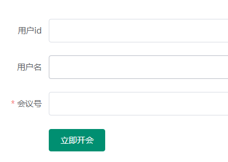

# 融云音视频会议与屏幕共享 im 客户端

## 获取 im 实例

- im 实例方法在整个生命周期只需要执行一次，所以在 create 期间执行即可

```js
data(){
  return {
    appkey: '融云后台 appkey',
    appSecret: 'appSecret',
    im: null,
    loadingText: '',
  }
}
created() {
  /*
    ... 一些验证用户名，用户id的代码
   */
  this.imInit(); // 获取 im 实例 只能初始化一次
}
methods: {
  imInit() { // 获取 IMLib 实例
    this.loadingText = '初始化实例';
    this.im = RongIMLib.init({ appkey: this.appKey });
  },
}
```

## 获取 token

初始化 im 之后，在获取 token 之前验证需要提交的表单



房间号加入和创建是一样的，没有就会创建一个房间

```js
import {getTokenYJZH} from '@/api/index'; // '/user/getToken.json'
import headers from './headers'; // 引入封装好的请求头加密方法
import qs from 'qs' // 引入qs模块，用来序列化post类型的数据

data(){
  return{
    userInfo: { // 用户信息
      userId: "", // 用户id
      name: "", // 用户名
      url: "", // 头像
    },
    token: '',
  }
},
methods: {
  /* 点击加入房间执行 */
  async submitForm() {
    // 验证表单
    let flag = false;

    this.$refs.form.validate((valid) => (flag = valid));

    if (!flag) return this.$message.error("请输入完整信息后再确认！");

    this.showForm = false;
    this.loading = true;

    // 开始后续的连接
    const isLoadOver = await this.start();
    if (isLoadOver === false) return (this.showForm = true);

    this.loading = false;
  },
  async start() {
    if (!this.im) return this.$message.error("初始化失败！"), false;

    /* 获取 token */
    let [e, {token}] = await this.getToken(); //
    if (e) return this.$message.error("获取用户信息失败！"), false;
    this.token = token;

    /* 文章后续的操作在此处继续 */
  },
  // 获取token
  getToken() {
    this.loadingText = '获取用户信息';
    return new Promise(res => {
      getTokenYJZH({
        headers: headers({
          appSecret: this.appSecret,
          appKey: this.appKey,
        }),
        data: qs.stringify({
          userId: this.userInfo.userId,
          userName: this.userInfo.name,
          photo: this.userInfo.url,

        }),
      }).then(({data}) => {
        res([null,data]);
      }).catch(e => {
        res([e])
      })
    })
  },
}
```

## 监听 IMLib 连接状态变化

- 在上面获取 token 的 start 方法中进行下一步操作
- 上面只是获取了 token，在开始连接 im 之前可以设置监听 im 连接状态

```js
methods: {
  async start() {
    /*
      此处获取 token 代码
     */
    this.watch(); // 监听 im
  },
  // 监听 IMLib 连接状态变化
  watch() {
    this.loadingText = '监听连接';
    this.im.watch({
      // IM 连接状态变更通知
      status(status) {
        console.log(status);
        /* 做一些操作 */
      }
    })
  },
}
```

## 建立 IM 连接

im 连接成功之后即可开始加入房间（rtc 操作）

```js
methods: {
  async start() {
    /*
      此处获取 token 代码
      监听 im
     */
    [e, data] = await this.linkIM(); // 开始 im 连接
    if (e) return this.$message.error("连接失败，请刷新重试！"), false;
  },
  // 建立 IM 连接
  async linkIM() {
    this.loadingText = '开始连接';
    try {
      const user = await this.im.connect({ token: this.token })
      return Promise.resolve([null, user])
    } catch (error) {
      console.log('链接失败: ', error.code, error.msg);
      return Promise.resolve([error])
    }
  }
}
```
