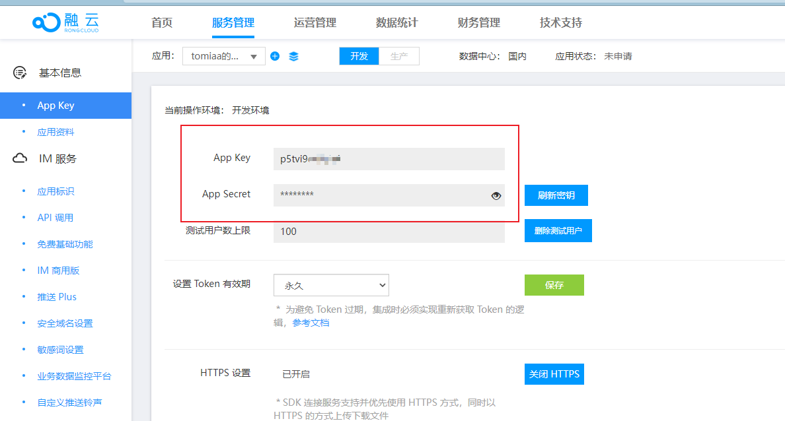

# Vue 融云音视频会议与屏幕共享前期准备

## 前期准备

### APP Key 和 App Secret

前往[融云开发者后台获取](https://developer.rongcloud.cn/app/appkey/BgsFzY6ZM7cbSMPYREXVaA)

APP Key 和 App Secret 主要作用于获取用户 token，以及在请求融云 api 接口时需要设置请求头




### npm 依赖安装

```sh
# 安装 RongIMLib v4
npm install @rongcloud/imlib-v4 --save
# 安装 RTCLib
npm install @rongcloud/plugin-rtc --save
# sha1 加密
npm i js-sha1
```

- @rongcloud/imlib-v4：为 im 客户端，主要用于获取用户 token，建立连接
- @rongcloud/plugin-rtc：rtc 客户端，主要用于加入房间、监听房间事件、推流（发布麦克风、屏幕、摄像头）
- js-sha1：调用融云 api 时，请求头需要用到此加密包

### 配置代理

```js
// vue.config.js
module.exports = {
  devServer: {
    proxy: {
      '/rongyun': {  // 融云视频会议服务器地址
        target: 'https://api-cn.ronghub.com',
        changeOrigin: true, //是否跨域
        secure: true, // 如果是https接口，需要配置这个参数
        pathRewrite: {
          '^/rongyun': '',
        }
      },
    },
  },
};
```

### 封装请求头加密方法
```js
/* 生成融云请求头签名 */
import sha1 from 'js-sha1';

export default function({appSecret,appKey}) {
  
  const Timestamp = new Date().getTime();
  const Nonce = Math.random();

  return {
    Signature: sha1(appSecret + Nonce + Timestamp),
    "App-Key": appKey,
    Timestamp,
    Nonce,
  }
}
```


