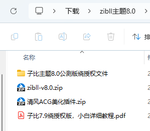

# 子比主题8.0破解版+授权文件+美化插件+安装教程

[购买地址](https://www.xinxinzy.top/2024/11/12/%E5%AD%90%E6%AF%94%E4%B8%BB%E9%A2%988-0%E7%A0%B4%E8%A7%A3%E7%89%88%E6%8E%88%E6%9D%83%E6%96%87%E4%BB%B6%E7%BE%8E%E5%8C%96%E6%8F%92%E4%BB%B6%E5%AE%89%E8%A3%85%E6%95%99%E7%A8%8B/)

V8.0
2024-10-15

新功能

适配 WordPress 6.6.2 版本

新增发帖选择板块、话题、标签时支持搜索，同时优化了选择栏目，更加方便快捷

新增小工具文章列表模块，代替之前的文章、文章 mini 模块，添加翻页、筛选等功能，性能更好

新增小工具多栏目文章模块，代替之前的多栏目文章、多栏目 mini 模块，添加翻页、筛选等功能，性能更好

链接列表页面模板新增多选分类并排序的功能，新增网址导航功能，新增链接重定向、新窗口打开等功能，同时更名为网址导航页面模板

为大部分小工具模块添加按页面 ID 来显示或隐藏模块的功能，可实现让模块只在部分页面显示或隐藏，让模块配置更加自由灵活

链接列表小工具模块新增卡片样式显示风格，同时优化了整体显示效果

新增推广返佣功能是否允许自己推广自己的选项(之前默认是允许自己使用自己的推广链接购买商品并获得佣金的，现在加了选项)

新增文章页面隐藏发布及更新时间显示的功能及选项

优化后台文章列表中显示销售数量时，同时显示真实销量

优化了文章下载模块在下载链接在新窗口打开

修复无法在后台修改用户认证状态的 bug

修复用户中心的分成商品的销售数量显示不正确的 bug

修复了论坛帖子在没有查看权限的情况下可能会通过网页审查查看到帖子简介的 bug

修复后台用户列表中可能会报错的 bug

修复用户点赞、热度数据可能会错误的 bug

修复有小工具容器的页面删除后，小工具容器可能还会存在的 bug

修复帖子数量数据错误的 bug

修复视频退出全屏后页面会滚动到顶部的 bug

修复视频剧集可能会保存不成功的 bug

修复用户收藏数量可能会显示错误的bug

修复优化了一些其他小问题

V7.9
2024-07-15

新增卡密兑换会员、卡密兑换积分、卡密充值的单密码模式，无需卡号仅需密码即可使用卡密的功能

新增商品优惠码功能，支持打折、立减、有效期等功能

优化主题设置的搜索功能，搜索配置时候更加精准、全面

优化底层数据库储存逻辑，减少 30%-50%数量库占用量，有效的提高了性能

多项底层性能优化措施，将会在更新时执行

V7.8
2024-06-15

新增自动检测用户浏览器性能情况，在性能较差的设备上将自动做性能优化处理（关闭高斯模糊特效，减少动画等），以提供更流畅的体验

新增付费下载连接自动识别 123 网盘、阿里云盘、迅雷网盘、夸克网盘、360 云盘的链接显示名称及图标

新增付费下载粘贴云盘生成的分享链接时，自动识别并填写链接及提取码

新增图片灯箱鼠标滚轮切换的功能，优化了灯箱切换动画效果

新增公众号搜索内容自动回复排除文章或帖子的功能

新增视频播放器倍速播放的功能

新增文章、帖子评论置顶功能，以及对应权限的权限管理

新增每个月自动清理一次未支付的无效订单

新增设置网站全局背景图功能

优化了文章内翻页按钮显示效果

优化封禁逻辑，自己不能禁封自己

优化帖子列表中的视频封面，播放时候会显示播放控件，方便调节进度和音量等

修复极少情况下购买积分时不显示积分商品的 bug

修复在极少情况下提现可能会出现商品金额不准确的 bug

修复分类页面文章计数可能会不准确的 bug

修复作者审核评论的可能会失效的 bug

修复有些情况下无法切换帖子板块的 bug

修复搜索结果可能会显示错误标题的 bug

修复古腾堡视频剧集块添加多个时候，内容可能会重复的 bug  