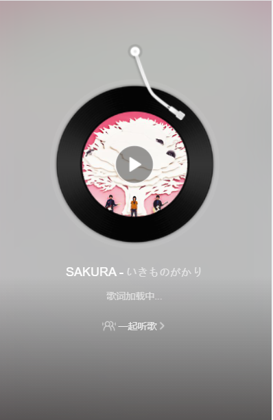
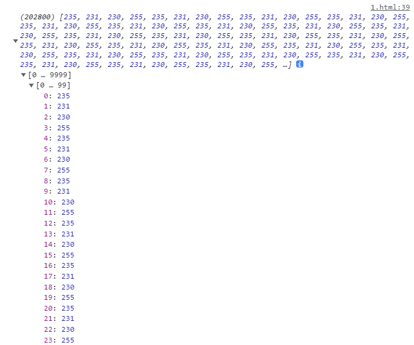
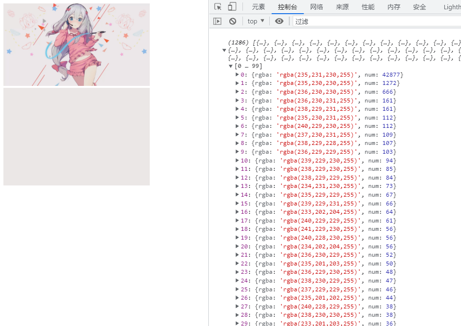

# JavaScript 提取一张图片的主题色

想必都见过网抑云和 QQ 音乐播放界面的背景，这种背景都是利用 css 属性 filter 进行高斯模糊处理的。



当然也有在图片加载之前，背景为这张图片的主题色。又或者更好一些则再图片由模糊到清晰的加载过程显示。

取得图片的主色调步骤主要分为：
1. 获取图片绘制在 canvas 画布上
2. 获取图片每个像素点的 rgba 值
3. 对所有像素点 rgba 值统计
4. 对统计的数据排序

接下来以这张图为例：


```html
<style>
  img{ width:300px; }
</style>
<body>
  
</body>
```

## 一、获取图片并绘制在 canvas 上

src 图片的加载是异步的，获取图片的宽高要等图片加载完成之后（onload）再获取，否则宽高都会是 0。

```js
const oImg = document.getElementById('img');
oImg.onload = function () {
  const w = this.width;
  const h = this.height;
  // 创建画布
  const canvas = document.createElement('canvas');
  canvas.width = w;
  canvas.height = h;
  // 绘制图片在画布上
  const context = canvas.getContext('2d');
  context.drawImage(this, 0, 0);
}
```

## 二、获取像素点 rgba 数据

```js
// onload 内
let pxArr = context.getImageData(0, 0, w, h).data;
pxArr = Array.from(pxArr);
```
此时打印 pxArr 是这样的：



每隔 4 个数字为一组，分别为 r、g、b、a 以此类推。

## 三、对 px 像素颜色数据统计
接下来只需要对数组进行每 4 个为一组的进行统计，统计出每个 rgba 颜色的次数。

```js
// onload 内
const colorList = {}
let i = 0;
while (i < pxArr.length) {
  const r = pxArr[i];
  const g = pxArr[i + 1];
  const b = pxArr[i + 2];
  const a = pxArr[i + 3];
  i = i + 4; // 最后 +4 比每次 i++ 快 10ms 左右性能
  const key = [r,g,b,a].join(',')
  key in colorList ? ++colorList[key] : (colorList[key] = 1)
}
```
此时 colorList 打印是这样的：


:::tip 注意
不能用数组的 splice 来取4位数，这样会对原数组进行改变而影响性能。
:::

## 四、对统计的数据进行排序

```js
// onload 内
let arr = [];
for(let key in colorList){
  arr.push({
    rgba: `rgba(${key})`,
    num: colorList[key]
  })
}
arr = arr.sort((a,b) => b.num - a.num)
```
再打印 arr 查看图片的主色调：


