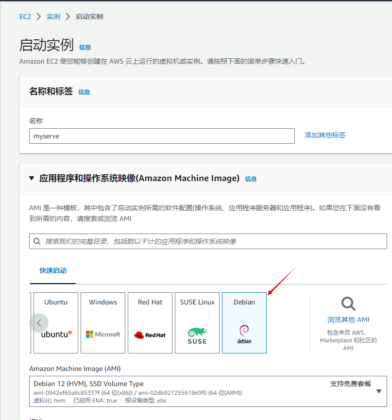
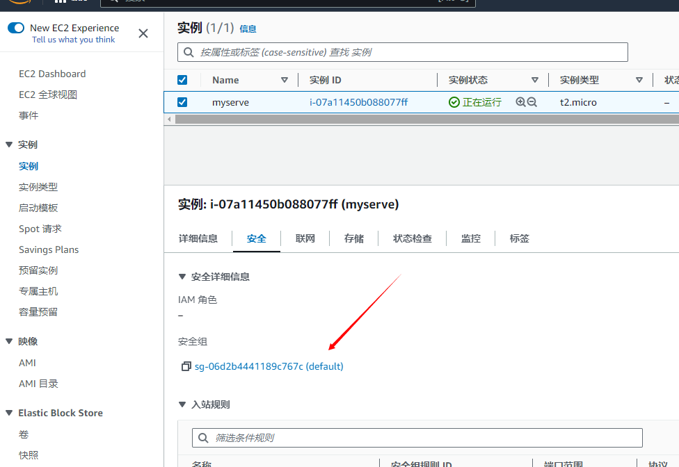
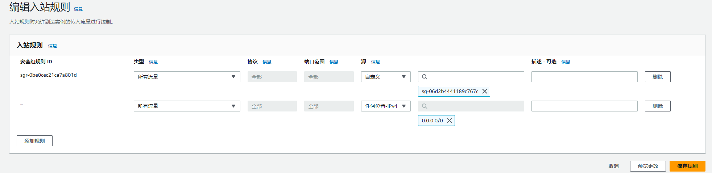
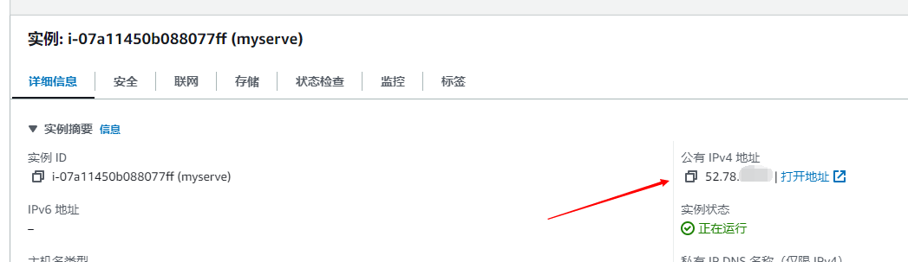
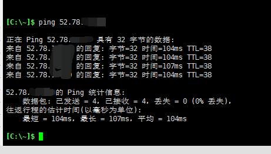
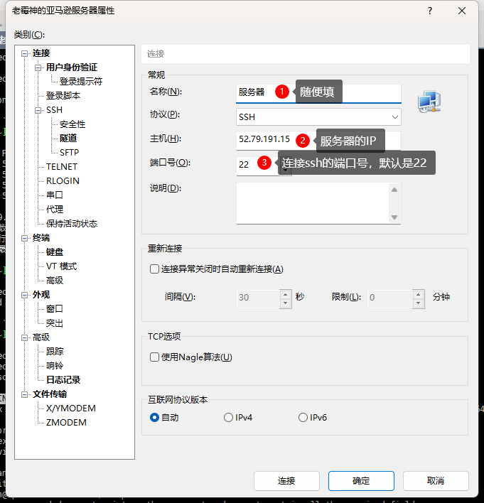
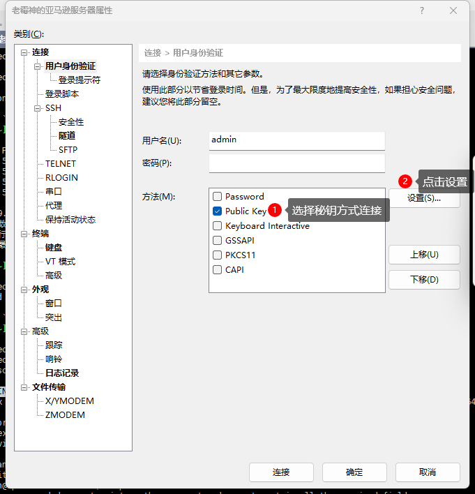
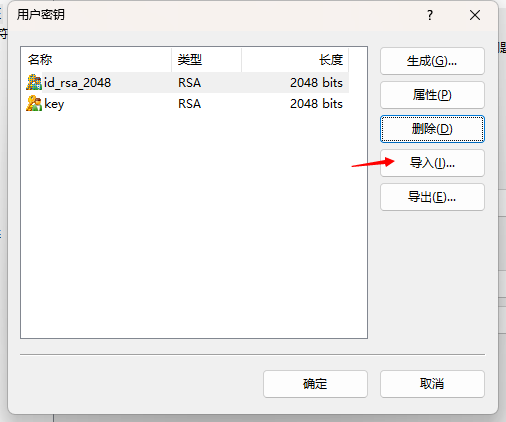
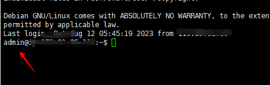
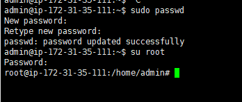

# v2ray服务器搭建创建订阅链接

## 创建服务器

这里以亚马逊服务器为例，创建时选择`Debian`镜像的服务器。



**创建时选择密钥对，没有则需要创建新的密钥对（创建后会自动下载pem后缀的秘钥文件），用于后续连接服务器**


## 配置安全组



入站规则允许所有流量可以进入，你也可以配置某个v2ray的端口允许访问（要搭建完成后可以查看)


出站规则也是同理

## 测试能否ping通服务器

查看服务器IP


测试能否访问服务器

`window+r`输入`cmd`回车，输入`ping 服务器的ip`

不能ping通说明ip可能被国内封了，需要重新开一个服务器新的IP


## 使用xshell连接服务器

- 需要下载`xshell`软件
- 点击文件 - 新建

- 设置用户身份验证

- 添加秘钥文件（为创建服务器时下载的pem秘钥文件），导入后选择确定即可

- 添加秘钥后点击连接

连接成功后默认的账号不是root账号，需要先设置root账号的密码，再切换为root账号



```sh
sudo passwd # 设置root账号的密码

# 设置完成后切换到root用户
su root
```



## 一键搭建v2ray服务

控制台输入脚本搭建 v2ray 服务器

```sh
bash <(curl -s -L https://git.io/v2ray.sh)
```

完成示例
```sh
........... V2Ray script by 233boy ..........

开始安装...
下载 jq > https://github.com/jqlang/jq/releases/download/jq-1.7rc1
下载 V2Ray 脚本 > https://github.com/233boy/v2ray/releases/latest/download/code.zip
下载 V2Ray > https://github.com/v2fly/v2ray-core/releases/latest/download/v2ray-linux-64.zip
安装依赖包 > unzip
生成配置文件...

使用协议: VMess-TCP
-------------- VMess-TCP-30652.json -------------
协议 (protocol) 	= vmess
地址 (address) 		= 52.79.xx.xx
端口 (port) 		= 306
用户ID (id) 		= 2-8d4a-e1fdf1b49d7e
传输协议 (network) 	= tcp
伪装类型 (type) 	= none
------------- 链接 (URL) -------------
vmess://eyJ2Ixxx
------------- END -------------
```

安装完成后输出的URL可以添加到v2ray软件中使用，也可以控制台输入`v2ray`命令修改各种配置

添加到`v2ray`中:
1. 复制控制台输出的以`vmess://`开头的链接，找不到可以输入命令`v2ray url`显示
2. 打开`v2ray`桌面右下角控制栏图标右键`从剪贴板批量导入URL`

## 域名伪装（可选）

在v2ray中地址这一列显示的是服务器的IP，伪装就是使用域名来访问，而不直接暴露IP在外面

1. 输入`v2ray`-添加配置-选择带有TLS的配置
2. 接下来会输入域名绑定
3. 同时，域名的解析需要添加A记录，记录值填到你服务器的IP即可（这会占用服务器的80与443端口，如果服务器已经部署网站则不适用）。

## 创建订阅链接

订阅的链接是在v2ray中添加订阅之后，节点有更新的情况下不需要手动添加，只需要更新订阅的链接即可。

要创建订阅永久链接你需要有一个地址，比如：`https:xxx.com/v2.txt`，更新的时候就是下载这个地址的文件去解析的。

1. 手动选择（可以多选）添加到v2ray的节点，然后复制（ctrl + c）
2. 当前复制的是一串订阅的地址，你需要把他转成base64的编码格式字符串
3. 新建一个txt文件粘贴转换为base64的文字
4. 放在服务器上使得外网可以访问
5. 添加订阅为这个地址即可


