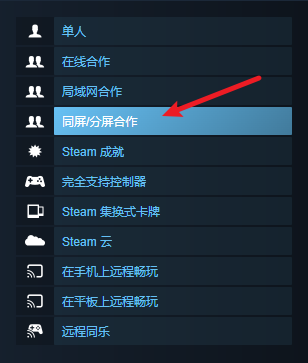
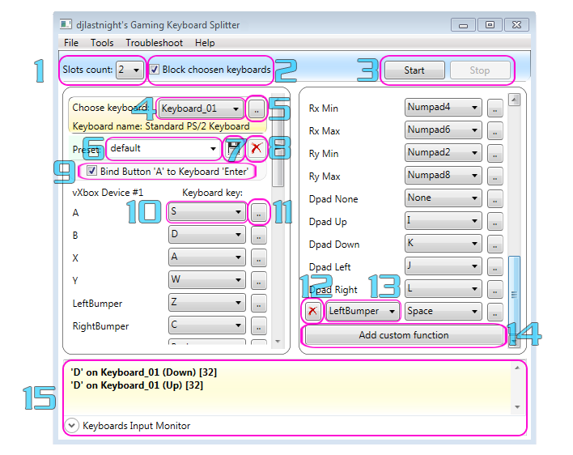
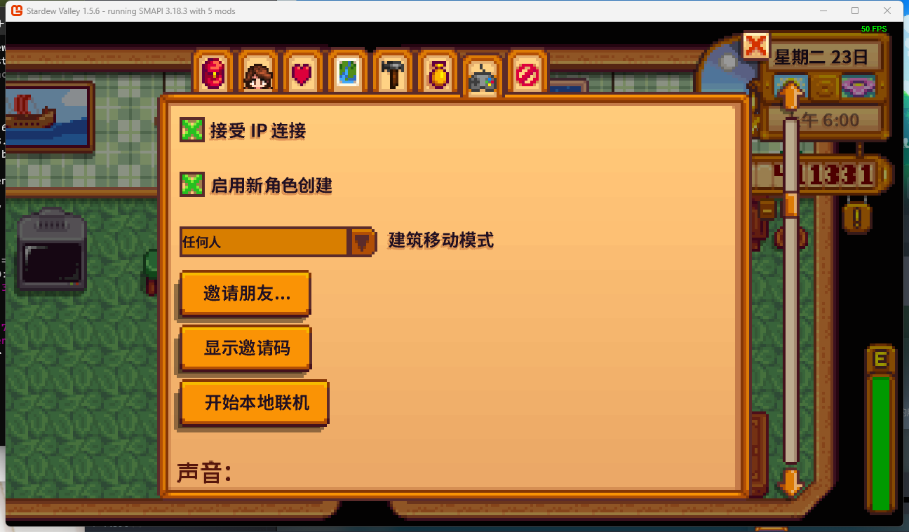
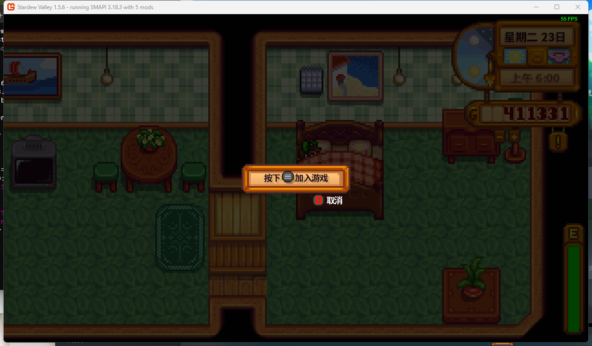
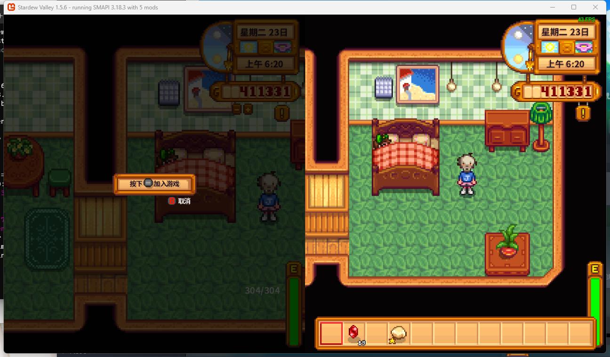

# 一台电脑实现双人分屏本地联机游戏

## 前置条件

此教程实现了只有一台电脑的，本地联机双人游玩游戏，**原理是通过两个键盘来模拟的，一个键盘就是电脑的键盘，另一个键盘则通过软件拦截驱动模拟手柄操作来实现**（也可以多个键盘都模拟成手柄），在电脑系统中，`A`键盘按下空格键就相当于`B`键盘按下空格键，所以才需要一个是键盘，一个是手柄，当然如果你玩的游戏本身支持双键盘游玩，那也不需要考虑这种方式了（如：胡闹厨房），要做到以上操作需要有以下条件：

1. 你玩的游戏需要支持本地双人联机，比如`steam`游戏商店界面有显示
   {data-zoomable}
2. 你需要有两个键盘
3. 你需要下载[Keyboard.Splitter](https://github.com/djlastnight/KeyboardSplitterXbox/releases)来让键盘模拟成手柄，[直接下载](https://github.com/djlastnight/KeyboardSplitterXbox/releases/download/2.2.0.0/Keyboard.Splitter.2.2.0.0.zip)

## Keyboard.Splitter 使用

{data-zoomable}

如上图所示

- 标注1：选择你要几个键盘去模拟成手柄，支持键盘+手柄联机就选择 1 个即可
- 标注5：点击标注5，会弹出一个框，在你想要哪个键盘被模拟成手柄的键盘上按下任意键，即可设置为当前键盘
- 标注6：选择默认的按键映射的配置方案，有`switch`、`xbox`等，默认即可
- 标注10：可以看到键盘`S`对应手柄的`A`，可以修改对应的按键映射
- 注意：示例图版本可能较低，标注 1 下方新版有是否开启鼠标映射，不需要就选择`none`即可。
- 在配置完成后点击标注3`start`开始映射即可开始游戏。

## 游戏联机示例

### 星露谷物语

以合作模式开始游戏后，设置中开启本地联机按钮，随后按下开启映射键盘的`esc`键（默认映射手柄的菜单按键）加入即可

{data-zoomable}

{data-zoomable}

{data-zoomable}

### 神界原罪

神界原罪主界面跟星露谷一样，开启手柄映射之后主界面会变成手柄的界面，按下手柄的菜单键加入联机即可

{data-zoomable}
