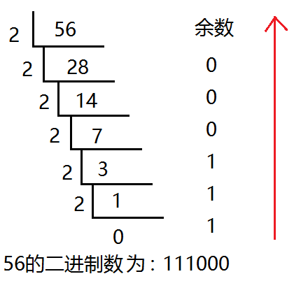
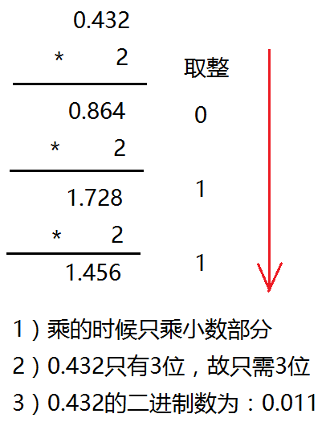

# 二进制

二进制是计算技术中广泛采用的一种数制。二进制数据是用 0 和 1 两个数码来表示的数。
它的基数为 2，进位规则是“逢二进一”，10 进制的 1 二进制表示 1，10 进制 2 在二进制由 10 表示。

当前的计算机系统使用的基本上是二进制系统，数据在计算机中主要是以补码的形式存储的。

| 十进制 | 二进制 |
| ------ | ------ |
| 0      | 0      |
| 1      | 1      |
| 2      | 10     |
| 3      | 11     |
| 4      | 100    |
| 5      | 101    |
| 6      | 110    |
| 7      | 111    |
| 8      | 1000   |
| 9      | 1001   |
| 10     | 1010   |
| 11     | 1011   |
| 12     | 1100   |
| 13     | 1101   |
| 14     | 1110   |
| 15     | 1111   |
| 16     | 10000  |

## 内存单位

| 术语         | 含义                                                                                                   |
| ------------ | ------------------------------------------------------------------------------------------------------ |
| bit(比特)    | 一个二进制代表一位，一个位只能表示 0 或 1 两种状态。数据传输是习惯以“位”（bit）为单位。                |
| Byte(字节)   | 一个字节为 8 个二进制，称为 8 位，计算机中存储的最小单位是字节。数据存储是习惯以“字节”（Byte）为单位。 |
| WORD(双字节) | 2 个字节，16 位                                                                                        |
| DWORD        | 两个 WORD，4 个字节，32 位                                                                             |
| 1b           | 1bit，1 位                                                                                             |
| 1B 1Byte,    | 1 字节，8 位                                                                                           |
| 1k，1K       | 1024                                                                                                   |
| 1M(1 兆)     | 1024k, 1024 \* 1024                                                                                    |
| 1G           | 1024M                                                                                                  |
| 1T           | 1024G                                                                                                  |
| 1Kb(千位)    | 1024bit,1024 位                                                                                        |
| 1KB(千字节)  | 1024Byte，1024 字节                                                                                    |
| 1Mb(兆位)    | 1024Kb = 1024 \* 1024bit                                                                               |
| 1MB(兆字节)  | 1024KB = 1024 \* 1024Byte                                                                              |

## 十进制整数转二进制

除二反序取余法，用十进制数除以 2，分别取余数和商数，商数为 0 的时候，将余数倒着数就是转化后的结果。

## 十进制的小数转二进制

小数部分和 2 相乘，取整数，不足 1 取 0，**每次相乘都是小数部分**，顺序看取整后的数就是转化后的结果。

## 二进制转十进制

权值法，将一个二进制数从末尾（右边）开始数个数，假设为 n，乘以 2 的 n 次幂，n 从 0 开始。

如二进制数`1111011`：

`[二进制的数] * 2^[n]`

- `1 * 2^0 = 1`
- `1 * 2^1 = 2`
- `0 * 2^2 = 0`
- `1 * 2^3 = 8`
- `1 * 2^4 = 16`
- `1 * 2^5 = 32`
- `1 * 2^6 = 64`

最后相加`1+2+0+8+16+32+64 = 123`，123 就是转换成十进制的结果
