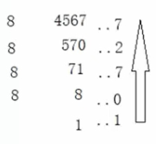

# 八进制

八进制，Octal，缩写 OCT 或 O，一种以 8 为基数的计数法，采用 0，1，2，3，4，5，6，7 八个数字，逢八进 1。一些编程语言中声明变量时常常以数字 0 开头表明该数字是八进制。

八进制的数和二进制数可以按位对应（八进制一位对应二进制三位），因此常应用在计算机语言中。

| 十进制 | 八进制 |
| ------ | ------ |
| 0      | 0      |
| 1      | 1      |
| 2      | 2      |
| 3      | 3      |
| 4      | 4      |
| 5      | 5      |
| 6      | 6      |
| 7      | 7      |
| 8      | 10     |
| 9      | 11     |
| 10     | 12     |
| 11     | 13     |
| 12     | 14     |
| 13     | 15     |
| 14     | 16     |
| 15     | 17     |
| 16     | 20     |

## 十进制转八进制

除八反序取余法，用十进制数除以 8，分别取余数和商数，商数为 0 的时候，将余数倒着数就是转化后的结果。

最后十进制 4567 用八进制以 10727 表示

## 八进制转十进制

权值法，将一个八进制数从末尾（右边）开始数个数，假设为 n，乘以 8 的 n 次幂，n 从 0 开始。

如八进制数`173`：

`[八进制的数] * 8^[n]`

- `3 * 8^0 = 3`
- `7 * 8^1 = 56`
- `1 * 8^2 = 64`

最后相加`3+56+64 = 123`，123 就是转换成十进制的结果

