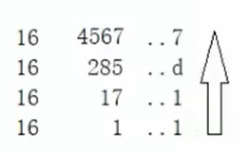

# 十六进制

十六进制（英文名称：Hexadecimal），同我们日常生活中的表示法不一样，它由0-9，A-F组成，字母不区分大小写。与10进制的对应关系是：0-9对应0-9，A-F对应10-15。

十六进制的数和二进制数可以按位对应（十六进制一位对应二进制四位），因此常应用在计算机语言中。

| 十进制 | 十六进制 |
| ------ | -------- |
| 0      | 0        |
| 1      | 1        |
| 2      | 2        |
| 3      | 3        |
| 4      | 4        |
| 5      | 5        |
| 6      | 6        |
| 7      | 7        |
| 8      | 8        |
| 9      | 9        |
| 10     | A        |
| 11     | B        |
| 12     | C        |
| 13     | D        |
| 14     | E        |
| 15     | F        |
| 16     | 10       |

## 十进制转十六进制

除十六反序取余法，用十进制数除以 16，分别取余数和商数，商数为 0 的时候，将余数倒着数就是转化后的结果。

最后十进制 4567 用八进制以 11D7 表示

## 十六进制转十进制

权值法，将一个十六进制数从末尾（右边）开始数个数，假设为 n，乘以 16 的 n 次幂，n 从 0 开始。

如八进制数`11D7`：

`[八进制的数] * 16^[n]`

- `7 * 16^0 = 7`
- `13 * 16^1 = 208`
- `1 * 16^2 = 256`
- `1 * 16^3 = 4096`

最后相加`7+208+256+4096 = 4567`，4567 就是转换成十进制的结果

