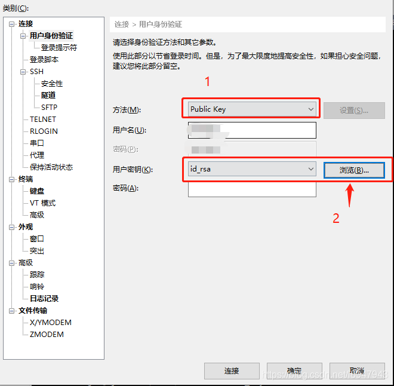

# 生成公钥私钥 xshell 连接服务器（可共用）

## 实现方式

- 需要下载`xshell`
1. 生成密钥（公钥和私钥）
2. 放置公钥（Public Key）到服务器`~/.ssh/authorized_key`文件中
3. 拷贝私钥（Private Key）自己妥善保存，用于认证，如果其他服务器也要用私钥连接，你需要把公钥复制到目标服务器上重复步骤2
4. 配置使用ssh客户端xshell使用密钥进行连接

## 生成秘钥（公钥与私钥）

- 运行`ssh-keygen -t rsa -P ''`生成公钥与私钥，生成的`id_rsa`为私钥，`id_rsa.pub`为公钥
- 使用`cat id_rsa`查看公钥与私钥的文件内容，保存下来，后续`id_rsa.pub`作为连接服务器使用，新服务器如果想要用同一个公钥连接，需要将`id_rsa`文件上传到相同的服务器目录


```sh
#1. 生成公钥和私钥
[root@home:~$] ssh-keygen -t rsa -P ''
#2. 弹出提示
Generating public/private rsa key pair.
#3. 选择存放key的文件的位置
Enter file in which to save the key (/home/.ssh/id_rsa):
#4. 提示输入生成公钥私钥使用的密码，可以默认，直接回车就行
Enter passphrase (empty for no passphrase):
Enter same passphrase again: 
#5. 显示公钥私钥生成的位置，不带.pub的是私钥，带.pub是公钥
Your identification has been saved in /home/.ssh/id_rsa.
Your public key has been saved in /home/.ssh/id_rsa.pub.
#6. 剩余的输出的信息
The key fingerprint is:
SHA256:bEnqIod+P9hUbwjAvTLJX8WClWIgPDnxFqxm/ZSSPTg 
The key's randomart image is:
+---[RSA 2048]----+
| .o=oo o.o       |
|  =o+.= o o      |
|   *oB +.o       |
|  +.E B+o.       |
| o   O.=So       |
|   . .+.. o      |
|  o o+.  .       |
| . oo.o          |
|  .. ...         |
+----[SHA256]-----+
```

## 服务器注册公钥

`id_rsa_2048.pub`改名为`authorized_keys`，服务器连接时的秘钥会读取该文件

```sh
[root@home:~]$ cd ~/.ssh/
# 将刚刚的公钥注册到authorized_keys中
[root@home .ssh]$ cat id_rsa_2048.pub >> authorized_keys
```

## xshell 连接

在连接服务器的配置时选择`public key`连接，点击浏览-导入-选择保存下来的`id_rsa`文件即可


