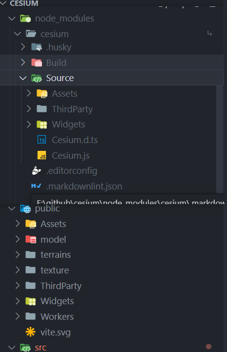

# Cesium 全局静态资源配置

1. 将 Cesium 静态资源文件放到项目的 public 文件夹下，并在项目中引用。



2. 再配置 Cesium 静态资源目录。

```ts
// App.vue
import * as Cesium from 'cesium'
import "cesium/Build/Cesium/Widgets/widgets.css";

// 设置静态资源目录
window.CESIUM_BASE_URL = '/';

// 默认加载看到的视角
Cesium.Camera.DEFAULT_VIEW_RECTANGLE = Cesium.Rectangle.fromDegrees(
  // 西边经度
  89.5,
  // 南边纬度
  20.4,
  // 东边经度
  110.4,
  // 北边纬度
  61.2
);

// token，在官网注册
Cesium.Ion.defaultAccessToken = "xxx"
```

