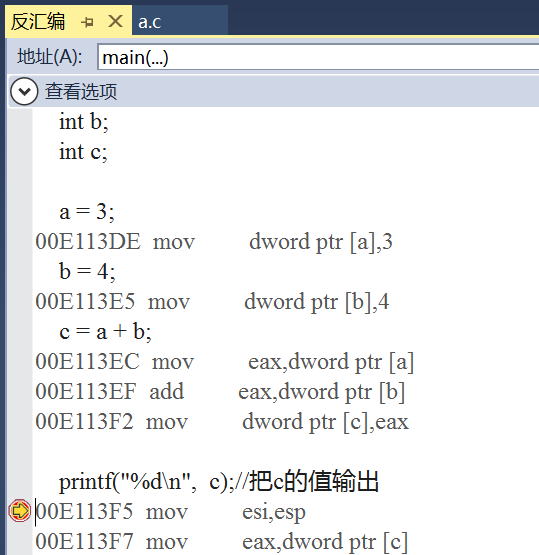

# CPU 内部结构与寄存器

- 寄存器是 CPU 内部最基本的存储单元
- CPU 对外是通过总线(地址、控制、数据)来和外部设备交互的，总线的宽度是 8 位，同时 CPU 的寄存器也是 8 位，那么这个 CPU 就叫 8 位 CPU
- 如果总线是 32 位，寄存器也是 32 位的，那么这个 CPU 就是 32 位 CPU
- 有一种 CPU 内部的寄存器是 32 位的，但总线是 16 位，准 32 为 CPU
- 所有的 64 位 CPU 兼容 32 位的指令，32 位要兼容 16 位的指令，所以在 64 位的 CPU 上是可以识别 32 位的指令
- 在 64 位的 CPU 构架上运行了 64 位的软件操作系统，那么这个系统是 64 位
- 在 64 位的 CPU 构架上，运行了 32 位的软件操作系统，那么这个系统就是 32 位
- 64 位的软件不能运行在 32 位的 CPU 之上

## 寄存器名字

| 8 位 | 16 位 | 32 位 | 64 位 |
| ---- | ----- | ----- | ----- |
| A    | AX    | EAX   | RAX   |
| B    | BX    | EBX   | RBX   |
| C    | CX    | ECX   | RCX   |
| D    | DX    | EDX   | RDX   |

## 寄存器、缓存、内存三者关系

按与 CPU 远近来分，离得最近的是寄存器，然后缓存(CPU 缓存)，最后内存。

CPU 计算时，先预先把要用的数据从硬盘读到内存，然后再把即将要用的数据读到寄存器。于是 CPU<--->寄存器<--->内存，这就是它们之间的信息交换。

那为什么有缓存呢？因为如果经常操作内存中的同一址地的数据，就会影响速度。于是就在寄存器与内存之间设置一个缓存。

因为从缓存提取的速度远高于内存。当然缓存的价格肯定远远高于内存，不然的话，机器里就没有内存的存在。

由此可以看出，从远近来看：CPU〈---〉寄存器〈---> 缓存 <---> 内存。

## C 语言嵌套汇编代码

```c
include <stdio.h>

int main()
{
	//定义整型变量a, b, c
	int a;
	int b;
	int c;

	__asm
	{
		mov a, 3	//3的值放在a对应内存的位置
		mov b, 4	//4的值放在b对应内存的位置
		mov eax, a	//把a内存的值放在eax寄存器
		add eax, b	//eax和b相加，结果放在eax
		mov c, eax	//eax的值放在c中
	}

	printf("%d\n",  c);//把c的值输出

	return 0;//成功完成
}
```

## 反汇编

- 正常编写的c代码

```c
#include <stdio.h>

int main()
{
	//定义整型变量a, b, c
	int a;
	int b;
	int c;

	a = 3;
	b = 4;
	c = a + b;
	
	printf("%d\n",  c);//把c的值输出

	return 0;//成功完成
}
```

- 设置断点F9


- 选择反汇编按钮


- 根据汇编代码分析程序


