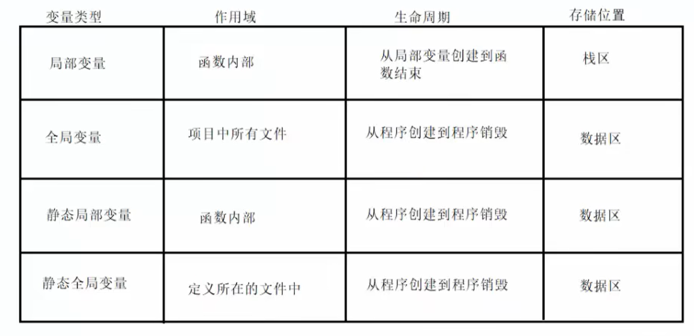
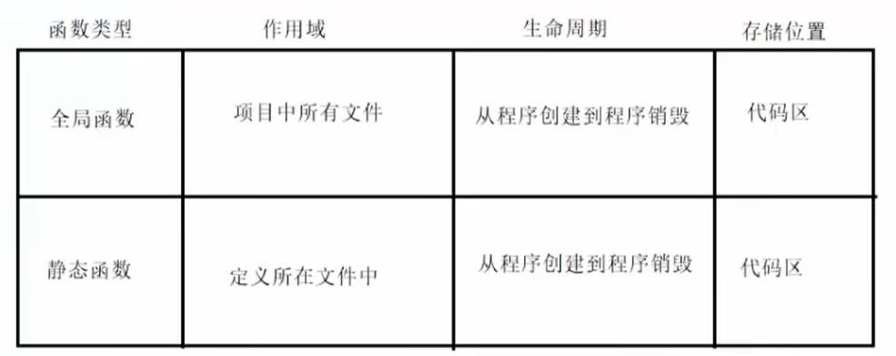
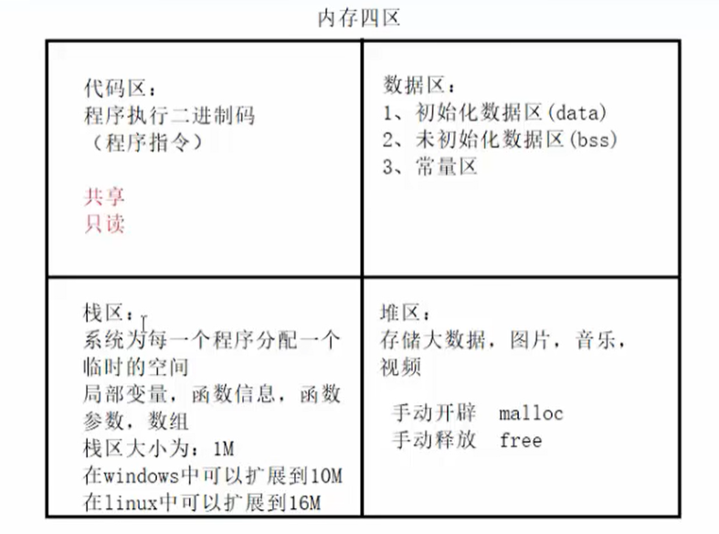
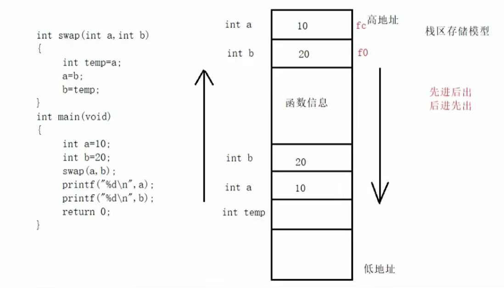

# 内存管理

## 全局变量

- 在函数外定义，可被本文件及其它文件中的函数所共用，若其它文件中的函数调用此变量,须用 extern 声明
- 全局变量的生命周期和程序运行周期一样
- 不同文件的全局变量不可重名

## 静态(static)全局变量

- 在函数外定义,作用范围被限制在所定义的文件中
- 不同文件静态全局变量可以重名,但作用域不冲突
- static 全局变量的生命周期和程序运行周期一样，同时 staitc 全局变量的值只初始化一次

```c
#include <stdio.h>

// 静态全局变量只能在本文件中使用
static int c = 10;
void sta()
{
  // 只会初始化一次
  // 只能函数内使用
  // 存在数据区
  static int i = 0;
  i++;
  printf("%d\n", i);
}
int main()
{

  int a = 0;
  while (a++ < 10)
  {
    sta();
  }

  return 0;
}
```



- 未初始化数据区（又叫 bss 区）
  存入的是全局未初始化变量和未初始化静态变量。未初始化数据区的数据在程序开始执行之前被内核初始化为 0 或者空（NULL）。

程序在加载到内存前，代码区和全局区(data 和 bss)的大小就是固定的，程序运行期间不能改变。然后，运行可执行程序，系统把程序加载到内存，除了根据可执行程序的信息分出代码区（text）、数据区（data）和未初始化数据区（bss）之外，还额外增加了栈区、堆区。


## 函数作用域

static 函数只能在本文件中使用，可以与全局变量重名



## 存储地址

```c
#include <stdio.h>

int a1;
int a2 = 1;

static int a3;
static int a4 = 2;

int main()
{

  int b1;
  int b2 = 1;
  static int b3;
  static int b4 = 1;

  int *p = "hello";
  int arr[] = { 0, 1, 2, 3};
  int *pp = arr;

  printf("未初始化全局变量：%p\n", &a1);
  printf("全局变量：%p\n", &a2);
  printf("未初始化静态全局变量：%p\n", &a3);
  printf("未初始化全局变量：%p\n", &a4);

  printf("未初始化局部变量：%p\n", &a1);
  printf("局部变量：%p\n", &a2);
  printf("未初始化静态局部变量：%p\n", &a3);
  printf("未初始化局部变量：%p\n", &a4);

  printf("字符串常量：%p\n", p);
  printf("数组：%p\n", arr);
  printf("指针变量：%p\n", pp);
  printf("指针地址：%p\n", &pp);


  return 0;
}
```

## 内存四区




## 栈区存储模型



