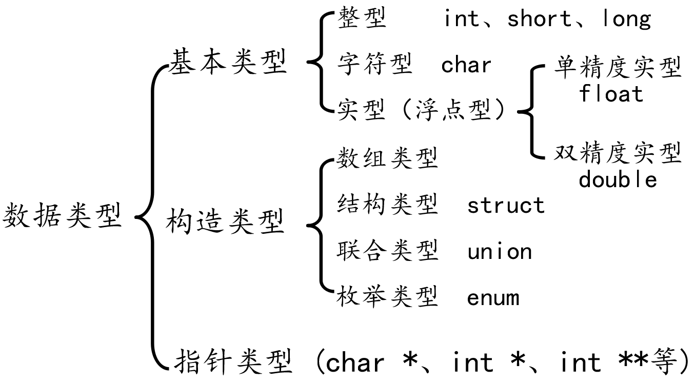

# C 语言常量与变量

## 关键字

- 数据类型关键字：char、short、int、long、float、double、unsigned、signed、struct、union、enum、void
- 控制语句关键字：if、else、switch、case、defaultfor、do、while、break、continue、goto、return
- 存储类关键字：auto、extern、 register、static、const
- 其他关键字：sizeof、typedef、volatile

## 数据类型

{data-zoomable}

## 声明

- 常量：
  1. 在程序运行过程中，其值不能被改变的量
  2. 常量一般出现在表达式或赋值语句中
- 变量：
  1. 在程序运行过程中，其值可以改变
  2. 变量在使用前必须先定义，定义变量前必须有相应的数据类型

```c
#include <stdio.h>
#define MAX 10 //声明了一个常量，名字叫MAX，值是10，常量的值一旦初始化不可改

int main()
{
	int a;	//定义了一个变量，其类型为int，名字叫a

	const int b = 10; //定义一个const常量，名为叫b，值为10
	//b = 11; //err,常量的值不能改变

	//MAX = 100;	//err,常量的值不能改变

	a = MAX;//将abc的值设置为MAX的值
	a = 123;

	printf("%d\n", a); //打印变量a的值

	return 0;
}
```

- 声明变量不需要建立存储空间，如：extern int a;
- 定义变量需要建立存储空间，如：int b;

```c
#include <stdio.h>

int main()
{
	//extern 关键字只做声明，不能做任何定义，后面还会学习，这里先了解
	//声明一个变量a，a在这里没有建立存储空间
	extern int a;
	a = 10;	//err, 没有空间，就不可以赋值

	int b = 10;	//定义一个变量b，b的类型为int，b赋值为10

	return 0;
}
```
