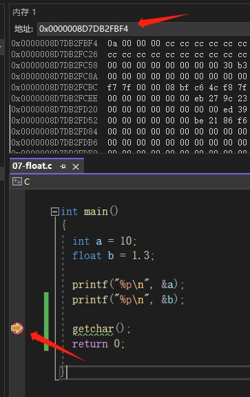

# C 语言 (实型)浮点型

实型变量也可以称为浮点型变量，浮点型变量是用来存储小数数值的。

C 语言中浮点型有两种：

1. 单精度浮点数(float)
2. 双精度浮点数(double)：double 型变量所表示的浮点数比 float 型变量更精确

## 声明

```c
#include <stdio.h>

int main()
{
  //传统方式赋值
	float a = 3.14f; //或3.14F
	double b = 3.14;
  float c = 3.14; // 不写f时在声明时是 double 类型再转换成 float 类型，实际使用没区别

  printf("%f\n", a);
  printf("%lf\n", b);
  printf("%f\n", c);

  // sizeof 查看字节大小
  printf("%d\n", sizeof(float));
  printf("%d\n", sizeof(double));

  //科学法赋值
	a = 3.2e3f; //3.2*1000 = 3200，e可以写E
	printf("a1 = %f\n", a);

	a = 100e-3f; //100*0.001 = 0.1
	printf("a2 = %f\n", a);

	a = 3.1415926f;
	printf("a3 = %f\n", a); //结果为3.141593
  
  // %e 可以把数字以科学计数法打印
	printf("c = %e\n", c);

}
```

## 查看内存地址

浮点型在内存中存储的格式为：符号位、指数位、小数位

使用`%p`打印的是变量对应的内存地址编号（无符号的 16 进制整数）

`&a`中的`&`表示取变量的内存地址

```c
int main()
{
  int a = 10;
  float b = 1.3;

  printf("%p\n", &a); // 000000C01516FBC4
  printf("%p\n", &b); // 000000C01516FBE4

  getchar(); // 这里在 vs 编辑器中打一个断点，方便查看内存地址
  return 0;
}
```

1. 如图所示，点击`getchar()`左侧位置出现红点
2. 接着运行调试-开始调试
3. 打开调试-窗口-内存-随便选一个内存
4. 在控制台输出的`printf("%p\n", &a);`赋值到图表所示位置粘贴搜索即可查看内存存放位置
   

由此看到在内存中是以`0a 00 00 00`开头存储的，按 16 进制来存储应该是`00 00 00 0a`才是 10 进制的 10。这里看到的不一样是因为在内存中有大小端对齐
