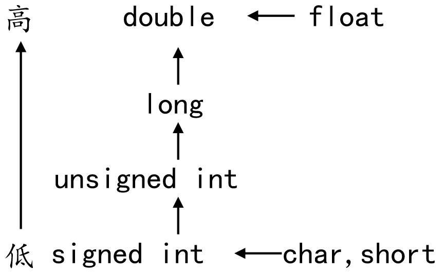

# 算术运算符

## 常用运算符分类

| 运算符类型    | 作用                                   |
| ------------- | -------------------------------------- |
| 算术运算符    | 用于处理四则运算                       |
| 赋值运算符    | 用于将表达式的值赋给变量               |
| 比较运算符    | 用于表达式的比较，并返回一个真值或假值 |
| 逻辑运算符    | 用于根据表达式的值返回真值或假值       |
| 位运算符      | 用于处理数据的位运算                   |
| sizeof 运算符 | 用于求字节数长度                       |

## 算术运算符

| 运算符 | 术语       |
| ------ | ---------- |
| +      | 正号       |
| -      | 负号       |
| +      | 加         |
| -      | 减         |
| \*     | 乘         |
| /      | 除         |
| %      | 取模(取余) |
| ++     | 前自增     |
| ++     | 后自增     |
| --     | 前自减     |
| --     | 后自减     |

```c
#include <stdio.h>

int main(void)
{
	int num = 5;
	int b = 0;
	// printf("%d\n", num / b); // 除数不能为 0

	printf("%d\n", num % 1); // 取余只能对整形操作

	return 0;
}
```

## 赋值运算符

| 运算符 | 术语   |
| ------ | ------ |
| =      | 赋值   |
| +=     | 加等于 |
| -=     | 减等于 |
| \*=    | 乘等于 |
| /=     | 除等于 |
| %=     | 模等于 |

## 比较运算符

| 运算符 | 术语     |
| ------ | -------- |
| ==     | 相等于   |
| !=     | 不等于   |
| <      | 小于     |
| >      | 大于     |
| <=     | 小于等于 |
| >=     | 大于等于 |

## 逻辑运算符

| 运算符 | 术语 |
| ------ | ---- |
| !      | 非   |
| &&     | 与   |
| \|\|   | 或   |

## 运算符优先级

| 优先级 | 运算符 | 名称或含义       | 使用形式                       |
| ------ | ------ | ---------------- | ------------------------------ |
| 1      | []     | 数组下标         | 数组名[常量表达式]             |
| 1      | ()     | 圆括号           | (表达式）/函数名(形参表)       |
| 1      | .      | 成员选择（对象） | 对象.成员名                    |
| 1      | ->     | 成员选择（指针） | 对象指针->成员名               |
| 2      | -      | 负号运算符       | -表达式                        |
| 2      | ~      | 按位取反运算符   | ~表达式                        |
| 2      | ++     | 自增运算符       | ++变量名/变量名++              |
| 2      | --     | 自减运算符       | --变量名/变量名--              |
| 2      | \*     | 取值运算符       | \*指针变量                     |
| 2      | &      | 取地址运算符     | &变量名                        |
| 2      | !      | 逻辑非运算符     | !表达式                        |
| 2      | (类型) | 强制类型转换     | (数据类型)表达式               |
| 2      | sizeof | 长度运算符       | sizeof(表达式)                 |
| 3      | /      | 除               | 表达式/表达式                  |
| 3      | \*     | 乘               | 表达式\*表达式                 |
| 3      | %      | 余数（取模）     | 整型表达式%整型表达式          |
| 4      | +      | 加               | 表达式+表达式                  |
| 4      | -      | 减               | 表达式-表达式                  |
| 5      | <<     | 左移             | 变量<<表达式                   |
| 5      | >>     | 右移             | 变量>>表达式                   |
| 6      | >      | 大于             | 表达式>表达式                  |
| 6      | >=     | 大于等于         | 表达式>=表达式                 |
| 6      | <      | 小于             | 表达式<表达式                  |
| 6      | <=     | 小于等于         | 表达式<=表达式                 |
| 7      | ==     | 等于             | 表达式==表达式                 |
| 7      | !=     | 不等于           | 表达式!= 表达式                |
| 8      | &      | 按位与           | 表达式&表达式                  |
| 9      | ^      | 按位异或         | 表达式^表达式                  |
| 10     | \|     | 按位或           | 表达式\|表达式                 |
| 11     | &&     | 逻辑与           | 表达式&&表达式                 |
| 12     | \|\|   | 逻辑或           | 表达式\|\|表达式               |
| 13     | ?:     | 条件运算符       | 表达式 1 ? 表达式 2 : 表达式 3 |
| 14     | =      | 赋值运算符       | 变量=表达式                    |
| 14     | /=     | 除后赋值         | 变量/=表达式                   |
| 14     | \*=    | 乘后赋值         | 变量\*=表达式                  |
| 14     | %=     | 取模后赋值       | 变量%=表达式                   |
| 14     | +=     | 加后赋值         | 变量+=表达式                   |
| 14     | -=     | 减后赋值         | 变量-=表达式                   |
| 14     | <<=    | 左移后赋值       | 变量<<=表达式                  |
| 14     | >>=    | 右移后赋值       | 变量>>=表达式                  |
| 14     | &=     | 按位与后赋值     | 变量&=表达式                   |
| 14     | ^=     | 按位异或后赋值   | 变量^=表达式                   |
| 14     | \|=    | 按位或后赋值     | 变量\|=表达式                  |
| 15     | ，     | 逗号运算符       | 表达式,表达式,… 左到右         |

## 类型转换




### 隐式转换

```c
#include <stdio.h>

int main(void)
{
	int num = 5;

	printf("%d\n", num / 2); // 2 整型运算得到整形
	printf("%f\n", num / 2.0); // 2.500000 有浮点数运算时得浮点数

	return 0;
}
```

### 强制转换

```c
#include <stdio.h>

int main(void)
{
	float a = 0;
	int i = 2;
	a = 3.5f;

	// i = a; // 浮点型直接赋值到整型会有警告

	i = (int)a; // 使用强制类型转换

  (int)a * i; // 6
  (int)(a * i); // 7

	printf("a = %f, i = %d\n", a, i);

	return 0;
}
```