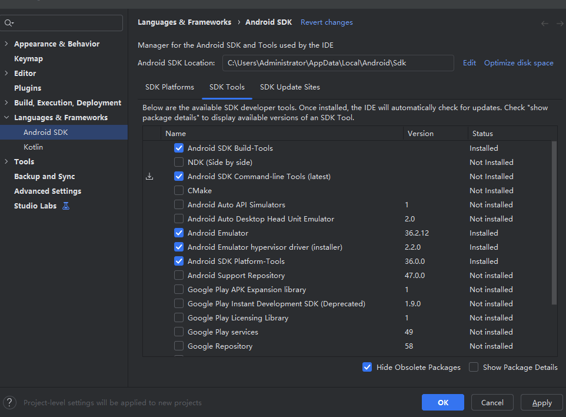

# Flutter 环境搭建

## Windows 安装

### 安装 Flutter

[Flutter sdk](https://docs.flutter.dev/install/archive?utm_source=chatgpt.com)

### powerShell 添加环境变量

```sh
[System.Environment]::SetEnvironmentVariable('Path', $env:Path + ";H:\flutter\bin", [System.EnvironmentVariableTarget]::User)
```

### 下载 Android Studio（官方）

Windows 上 Android SDK 没有单独官方下载包（zip 包已经被 Google 废弃）,必须通过 Android Studio 来下载 SDK。

[官方地址](https://developer.android.com/studio)

右上角 More Actions

进入 SDK Manager

在 SDK Platforms 勾选：
✔️ Android 14（或 Android 13 都行）

在 SDK Tools 勾选：
✔️ Android SDK Platform-Tools
✔️ Android SDK Build-Tools
✔️ Android SDK Command-line Tools
✔️ Android Emulator（可选）

点击 OK 下载。




```sh
C:\Users\你的用户名\AppData\Local\Android\Sdk
```

你打开 Android Studio → File → Settings → Appearance & Behavior → System Settings → Android SDK

这里能看到 SDK 路径。

### 添加环境变量（非常重要）

进入系统 → 环境变量 → PATH → 添加：

- `C:\Users\你的用户名\AppData\Local\Android\Sdk\platform-tools`
- `C:\Users\你的用户名\AppData\Local\Android\Sdk\cmdline-tools\latest\bin`

测试安卓 SDK 是否安装成功：

```sh
adb --version
```

### 让 Flutter 识别 SDK

```sh
flutter doctor --android-licenses
```


最后再运行：

```sh
flutter doctor
```


### fvm 管理 Flutter 版本

```sh
# 安装 fvm (如果未安装)
dart pub global activate fvm
# 安装某个版本 eg. 3.3.0 （示例）
fvm install 3.3.0
fvm use 3.3.0
# 然后用 fvm flutter 代替 flutter
fvm flutter pub get
fvm flutter run
```

- 查看 fvm 已安装的 Flutter 版本

```sh
fvm list

# 3.7.12 (global)
# 3.3.10
# 2.10.5
```

- 查看当前项目正在使用哪个 Flutter 版本

```sh
fvm flutter --version
```


## 镜像源

[镜像源](https://docs.flutter.cn/community/china/)

- 设置
```sh
$env:PUB_HOSTED_URL="https://pub.flutter-io.cn"
$env:FLUTTER_STORAGE_BASE_URL="https://storage.flutter-io.cn"
```

- 查看

```sh
echo $env:PUB_HOSTED_URL
```

- 删除

```sh
Remove-Item $env:PUB_HOSTED_URL
```


## vscode 调试断点

[地址](https://blog.csdn.net/Sakuramissing/article/details/135341873)

## Mac 安装 Flutter

本指南将帮助你在 macOS 上完整安装 Flutter 3.7.12 开发环境，包括代理配置、FVM 版本管理、Android Studio 和 Xcode 配置。

:::tip 前置要求
- macOS 系统
- 已安装 Homebrew
- 已安装并运行 ClashX（或其他代理工具）
- 代理端口为 7890（根据实际情况调整）
:::

### 配置代理环境

首先配置代理，以便顺利下载 Flutter 相关依赖。

#### 设置终端代理

```bash
# 配置代理环境变量
cat >> ~/.zshrc << 'EOF'

# ClashX 代理配置
export https_proxy=http://127.0.0.1:7890
export http_proxy=http://127.0.0.1:7890
export all_proxy=socks5://127.0.0.1:7890
EOF

# 重新加载配置
source ~/.zshrc
```

#### 配置 Git 代理

```bash
# 配置 Git 使用代理
git config --global http.proxy http://127.0.0.1:7890
git config --global https.proxy http://127.0.0.1:7890
```

:::warning 注意
每次打开新终端都需要代理配置生效，建议将配置添加到 `~/.zshrc` 文件中。
:::

### 安装 FVM

FVM (Flutter Version Management) 用于管理多个 Flutter 版本。

#### 安装步骤

```bash
# 禁用 Homebrew 自动更新
export HOMEBREW_NO_AUTO_UPDATE=1

# 添加 fvm tap 并安装
brew tap leoafarias/fvm
brew install fvm

# 验证安装
fvm --version
```

### 使用 FVM 安装 Flutter 3.7.12

#### 安装并设置默认版本

```bash
# 安装 Flutter 3.7.12（会通过代理下载）
fvm install 3.7.12

# 设置全局默认版本
fvm global 3.7.12

# 添加 FVM Flutter 到 PATH
echo 'export PATH="$HOME/fvm/default/bin:$PATH"' >> ~/.zshrc
source ~/.zshrc

# 验证 Flutter 版本
flutter --version
```

### 配置 Xcode

#### 设置 Xcode 命令行工具

```bash
# 设置 Xcode 命令行工具路径
sudo xcode-select --switch /Applications/Xcode.app/Contents/Developer

# 同意 Xcode 许可协议
sudo xcodebuild -license accept

# 安装 CocoaPods
sudo gem install cocoapods

# 验证安装
pod --version
```

### 安装 Android Studio

#### 使用 Homebrew 安装

```bash
# 禁用自动更新并安装
export HOMEBREW_NO_AUTO_UPDATE=1
brew install --cask android-studio
```

#### 首次启动配置

1. 打开 Android Studio
2. 选择 **"Standard"** 安装类型
3. 配置代理：
   - 点击 **Configure** → **Settings**
   - **Appearance & Behavior** → **System Settings** → **HTTP Proxy**
   - 选择 **"Manual proxy configuration"**
   - **HTTP Proxy**: `127.0.0.1`
   - **Port**: `7890`
   - 勾选 **"Use secure connection"**
   - 点击 **"Check connection"** 测试
   - 点击 **OK**

### 配置 Android SDK

在 Android Studio 中配置所需的 SDK 组件。

#### SDK Platforms

1. 打开 **Settings/Preferences** → **Appearance & Behavior** → **System Settings** → **Android SDK**
2. 在 **SDK Platforms** 标签页，勾选：
   - ☑️ Android 13.0 (Tiramisu) API Level 33
   - ☑️ Android 12.0 (S) API Level 31

#### SDK Tools

在 **SDK Tools** 标签页，勾选：
- ☑️ Android SDK Build-Tools
- ☑️ Android SDK Command-line Tools (latest)
- ☑️ Android Emulator
- ☑️ Android SDK Platform-Tools
- ☑️ Intel x86 Emulator Accelerator (HAXM installer) - 如果是 Intel Mac

点击 **Apply** 开始下载（会使用代理）

### 配置环境变量

#### 添加 Android SDK 路径

```bash
# 添加 Android SDK 环境变量
cat >> ~/.zshrc << 'EOF'

# Android SDK
export ANDROID_HOME=$HOME/Library/Android/sdk
export PATH=$PATH:$ANDROID_HOME/emulator
export PATH=$PATH:$ANDROID_HOME/platform-tools
export PATH=$PATH:$ANDROID_HOME/cmdline-tools/latest/bin
EOF

# 重新加载配置
source ~/.zshrc

# 验证路径
echo $ANDROID_HOME
adb version
```

### 配置 Gradle 代理

Gradle 需要单独配置代理以下载依赖。

```bash
# 创建 Gradle 全局配置目录
mkdir -p ~/.gradle

# 配置 Gradle 代理
cat > ~/.gradle/gradle.properties << 'EOF'
systemProp.http.proxyHost=127.0.0.1
systemProp.http.proxyPort=7890
systemProp.https.proxyHost=127.0.0.1
systemProp.https.proxyPort=7890

# 如果需要排除某些域名不走代理
systemProp.http.nonProxyHosts=*.google.com|localhost
EOF
```

:::tip 提示
这个配置非常重要，否则 Flutter 项目在构建 Android 应用时可能无法下载依赖。
:::

### 接受 Android 许可协议

```bash
# 确保代理已设置
export https_proxy=http://127.0.0.1:7890
export http_proxy=http://127.0.0.1:7890

# 接受所有 Android SDK 许可
flutter doctor --android-licenses
```

:::info 说明
在执行过程中，一路按 `y` 接受所有许可协议。
:::

### 安装 Flutter 和 Dart 插件

在 Android Studio 中安装 Flutter 插件。

#### 安装步骤

1. 打开 Android Studio
2. **Settings/Preferences** → **Plugins**
3. 搜索 **"Flutter"** 并点击 **Install**
4. Dart 插件会自动安装
5. 重启 Android Studio

### 配置 Flutter 镜像（可选）

如果代理不稳定，可以使用国内镜像加速。

```bash
# 使用清华镜像加速
cat >> ~/.zshrc << 'EOF'

# Flutter 中国镜像
export PUB_HOSTED_URL=https://pub.flutter-io.cn
export FLUTTER_STORAGE_BASE_URL=https://storage.flutter-io.cn
EOF

source ~/.zshrc
```

:::warning 注意
如果代理速度快，可以不配置镜像。镜像和代理同时使用可能会有冲突。
:::

### 安装低版本 java jvm
```sh
# 1. 安装 Java 11
brew install openjdk@11

# 2. 查看已安装的 Java 版本
/usr/libexec/java_home -V

# 3. 配置项目使用 Java 11 (在项目中设置)
export JAVA_HOME=$(/usr/libexec/java_home -v 11)

# 或者永久配置在 ~/.zshrc 中:
# echo 'export JAVA_HOME=$(/usr/libexec/java_home -v 11)' >> ~/.zshrc
```

### 验证安装

#### 运行 Flutter Doctor

```bash
# 检查 Flutter 环境
flutter doctor -v

# 预下载依赖
flutter precache
```

#### 期望输出

```
[✓] Flutter (Channel stable, 3.7.12, on macOS ...)
[✓] Android toolchain - develop for Android devices
[✓] Xcode - develop for iOS and macOS
[✓] Android Studio
[✓] Connected device
[✓] Network resources
```

如果所有项都显示 ✓，说明环境配置成功！

### 创建测试项目

#### 创建并运行 Flutter 项目

```bash
# 创建新项目
cd ~/Documents/github/test
flutter create test_app
cd test_app

# 获取依赖（会通过代理下载）
flutter pub get

# 运行项目（iOS 模拟器）
open -a Simulator  # 打开 iOS 模拟器
flutter run
```

#### 创建 Android 模拟器

在 Android Studio 中：
1. **Tools** → **Device Manager**
2. 点击 **Create Device**
3. 选择设备型号并创建

### 故障排除

#### 代理相关问题

如果下载很慢或失败，可以尝试以下方法：

```bash
# 1. 确认代理正在运行
curl -I --proxy http://127.0.0.1:7890 https://www.google.com

# 2. 测试代理连接
export https_proxy=http://127.0.0.1:7890
curl https://pub.dev

# 3. 清除 Flutter 缓存重试
flutter clean
rm -rf ~/.pub-cache
flutter pub get
```

#### 临时关闭代理

某些命令可能需要临时关闭代理：

```bash
# 关闭代理
unset http_proxy
unset https_proxy
unset all_proxy
```

#### 重新启用代理

```bash
# 重新启用代理
export https_proxy=http://127.0.0.1:7890
export http_proxy=http://127.0.0.1:7890
export all_proxy=socks5://127.0.0.1:7890
```

### 完整的环境检查

运行以下脚本检查所有环境配置：

```bash
# 检查所有环境
echo "=== Flutter ==="
flutter --version
which flutter

echo -e "\n=== FVM ==="
fvm --version
fvm list

echo -e "\n=== Android SDK ==="
echo $ANDROID_HOME
adb version

echo -e "\n=== Xcode ==="
xcodebuild -version

echo -e "\n=== CocoaPods ==="
pod --version

echo -e "\n=== 代理设置 ==="
echo "HTTP Proxy: $http_proxy"
echo "HTTPS Proxy: $https_proxy"

echo -e "\n=== Flutter Doctor ==="
flutter doctor -v
```

### 常见问题

#### Q: Flutter doctor 显示 Android licenses 问题？

**A**: 运行 `flutter doctor --android-licenses` 并一路按 `y` 接受。

#### Q: 下载依赖很慢怎么办？

**A**: 
1. 确认代理是否正常运行
2. 检查 Gradle 代理配置
3. 考虑使用国内镜像

#### Q: Xcode 相关问题？

**A**: 
1. 确保已安装 Xcode
2. 运行 `sudo xcode-select --switch /Applications/Xcode.app/Contents/Developer`
3. 运行 `sudo xcodebuild -license accept`

#### Q: Android Studio 无法下载 SDK？

**A**: 
1. 检查 Android Studio 的代理配置
2. 确保代理工具正在运行
3. 尝试手动下载 SDK

### 下一步

环境配置完成后，可以：
- 📱 学习 Flutter 基础知识
- 🎨 创建第一个 Flutter 应用
- 📖 阅读 [Flutter 官方文档](https://flutter.dev/docs)
- 🔧 探索 Flutter DevTools

:::tip 推荐
建议先完成 [Flutter Codelab](https://flutter.dev/docs/get-started/codelab) 来熟悉 Flutter 开发流程。
:::


### xcode版本切换

`brew install xcodesorg/made/xcodes`

```sh
# 列出所有可供安装的版本
xcodes list

# 安装指定版本的 Xcode (需要 Apple ID 密码)
xcodes install 15.4

# 列出本机已安装的 Xcode 版本
xcodes installed

# 切换到已安装的某个版本
xcodes select 15.4
```

