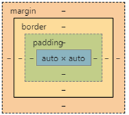

# CSS 盒模型、浮动、定位、布局...

css（Cascading Style Sheets）层叠样式表，级联样式表。

作用：

- 文本内容（字体，大小，对齐方式等）
- 图片的外形（宽高，边框样式，边距等）
- 版面布局以及外观显示（定位机制）

:::tip 提示

css 依附在 html 标签上的，如果没有 html 标签，css 是无效

:::

语法

```css
/* 选择器{ 属性: 属性值; } */
div {
  width: 1000px;
  height: 200px;
}
```

## 引入

1. 行间式

```html
<div style="width:300px;height:200px;background-color:tomato;"></div>
```

2. 内嵌式

```html
<head>
  <style>
    选择器{声明;}
  </style>
</head>
```

3. 外链式

```html
<head>
  <link
    href="./css/style.css"
    rel="stylesheet"
  />
</head>
```

## css 的书写顺序

1. float/position/display
2. 盒模型
3. background
4. 文本属性：text- font- line- list- color

- 布局定位属性 --> 自身属性 --> 文本属性 --> 其他属性

## 单位

- px：绝对单位
- em：相对单位，相对当前元素的 font-size 属性
- rem：相对单位，（html）的 font-size 计算
- fr：相对单位，0.3fr 表示占剩余空间的 0.3 倍
- vw/vh：相对单位，相对当前浏览器视口的宽高

## 盒模型



包含：内容 - content（width 和 height）+ padding（内边距） + border（边框）+ margin（外边距）

- max-width 和 max-height：设置元素的最大宽度和最大高度
- min-width 和 min-height： 设置元素的最小宽度和最小高度

### box-sizing

```css
box-sizing: content-box | border-box;
```

- 标准盒模型的计算方式：

  盒子的总宽度 = width + padding + border + margin

- 怪异盒模型（IE 盒模型）

  盒子的总宽度 = width（包含 padding+border） + margin

## 权值（权重）

- 具有继承属性：

  - font- 系列
  - line- 系列
  - color 颜色
  - text- 系列（除 text-decoration）

- 优先级
  - !important：1000 高于行间样式，但是没有自己本身样式优先级高
  - id：100
  - class：10
  - 标签：1
  - \*（通配符）：0

## font 和 text

```css
font-weight: normal 正常不加粗，bold 粗体，bolder 更粗，数字
/* 100-500不加粗 600以上加粗 700=bold  900=bolder */

font-style: normal 正常，italic 斜体

line-height : normal，length，number 数字会与字体大小相乘，倍数行距

font: font-style font-weight font-size/line-height font-family;
/* 必须同时有font-size和font-family;顺序不能更换 */

text-align: 文字对齐，text-align-last 最后一行对齐方式，一行
/* justify   两端对齐 行内元素无效。 */

text-decoration : none，underline 下划线，overline 上划线 ， line-through 删除线
```

## margin 传递与塌陷

- 父子关系
  - 现象：给子标签设置上外边距时，会和父盒子的外边距重合，最终表现其中较大值的外边距。
  - 原因：父子盒子公用了一个上外边距的区域
  - 解决方法：
    - 1. 给父级盒子设置边框或者是内边距
    - 2. 给父标签设置 overflow: hidden 属性，触发 BFC 规则（块级格式上下文），把父元素渲染成一个独立的区域。
- 兄弟关系
  - 现象：上一个盒子设置下外边距，下一个盒子设置上外边距，最终会显示其中较大值的外边距。
  - 原因：上下两个兄弟关系的盒子共用了一个外边距区域
  - 解决方法：
    - 1. 给两个盒子各套一个父盒子，父盒子添加 overflow:hidden 属性
    - 2. 给其中某一个盒子设置外边距

## BFC

- 什么是 BFC ？

  一个浏览器渲染元素的规则（块格式上下文）

- 如何触发元素的 BFC 规则？

  元素浮动 元素绝对定位 元素类型为 inline-block 等 overflow 不等于默认值 visible

- BFC 规则具体表现：

  父元素的上下边距不再合并 父元素的高度会将浮动元素计算在内

## 清除浮动

- 父元素设置高度（不建议）

- 父元素 overflow: hidden | scroll | auto

  - 最后加一个空的块标签，该标签设置 clear : left | right | both （不为 none 即可）

- 伪元素创建（推荐）

  ```css
  .clearfix:after {
    content: "";
    display: block;
    clear: both;
  }
  .clearfix {
    *zoom: 1; /* 用来解决ie7及以下版本不兼容伪元素问题 */
  }
  ```

## 定位

```css
position:static | relative | absolute | fixed | sticky ;
z-index：10
```

- static（定位的不定位）默认值
- sticky 粘性定位
- z-index 定位才有效

## 定位浮动区别

- float：脱离文档流，不脱离文本流
- position：脱离文档流，也脱离文本流
- 脱标后，margin: auto 无效

## 显示隐藏

- 隐藏：
  1. display: none; 隐藏
  2. visibility: hidden; 隐藏，所占的空间保留
- 显示：

  1. display: block; 转块显示
  2. visibility: visible; 显示

## overflow 属性

- overflow：包括水平垂直方向
- overflow-x：只包括 水平方向
- overflow-y ：只包括 垂直方向

  - visible 默认值，显示，不裁剪
  - hidden 内容直接被裁剪隐藏
  - scroll 内容会被隐藏，但是浏览器可以显示上下和左右滚动条显示隐藏的内容
  - auto 内容会被隐藏，浏览器会根据具体的情况显示上下或者左右滚动条显示内容

## 透明

```css
opacity:0
filter:Alpha(opacity=50)
```

- opacity：0-1 之间 IE8- 不兼容
- rgba(0,0,0,0)： 透明背景颜色，元素不透明 IE8- 不兼容
- filter: Alpha(opacity=x) IE 透明背景及内容 仅支持 IE6，7，8，9；IE10 被废除

## autoprefixer 自动生成前缀

1. vscode 在扩展 - 搜索 ”autoprefixer“ 安装

2. 在 “管理” - “安装另外一个版本” 2.2.0

3. 在 css 文件中，按 “f1"，选择 “autoprefixer CSS”
