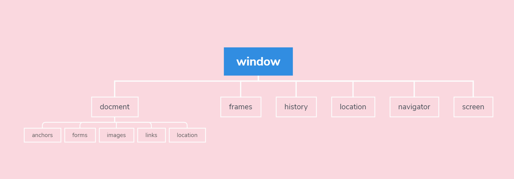

# JavaScript BOM 常用方法



## 系统对话框

```js
alert("hello")
confirm("确定？") // 返回 true false
prompt("输入文本", "默认文本") // 返回输入的值，取消返回 null
window.print() // 打印对话框
window.find() // 查找对话框
```

### console.time()

```js
console.time("test1")
var div = document.getElementById("div")
console.timeEnd("test1")
```

测试从上一个 test1 到这行代码运行所用的时间

## open 及 close

```js
open(url,'新窗口命名','新窗口尺寸'，'是否替换当前历史记录 boolean 值')
close() // 关闭当前页面
```
