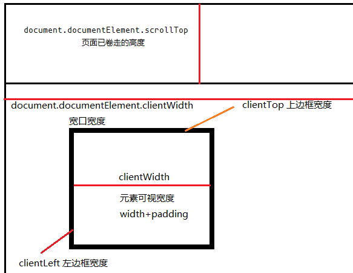

# JavaScript client、client、scroll 窗口位置

```js
p.clientWidth // 可视宽度 width + padding
p.clientTop // 上边框宽度
p.clientLeft // 左边框宽度
p.offsetParent // 获取上一个带有定位的父元素
p.offsetWidth // 占位宽度 width + padding + border
p.offsetLeft // 距上一个具有定位元素边框的距离

document.documentElement.clientWidth || document.body.clientWidth // 宽口宽度
document.documentElement.scrollTop / Left // 已滚动出的距离
```


