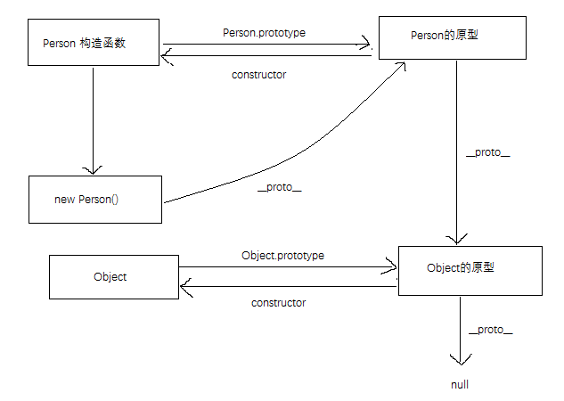
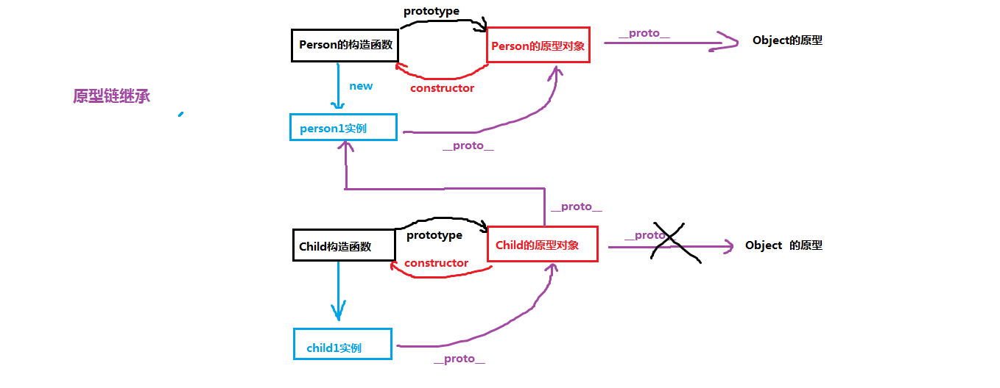

# JavaScript 面向对象-原型继承





## 原型链继承

```js
function Person(name) {
  this.name = name
}
Person.prototype.fn = function () {
  console.log("parent")
}
function Child() {}
Child.prototype = new Person("name") // new 之后 只是实例化的对象，下面有 __proto__
Child.prototype.constructor = Child // 手动修改回来
var child = new Child()
// 在原型上继承，子类不能修改和传参进去
```

## 对象冒充继承（借用构造函数

```js
function Parent(name) {
  this.name = name
}
Parent.prototype.fn = function () {
  console.log("parent")
}
function Child(name) {
  Parent.call(this, name)
}
var child = new Child("xiaohong")
```

## 组合继承

```js
function Parent(name) {
  this.name = name
}
Parent.prototype.eat = function () {
  console.log("11")
}
function Child(name) {
  Person.call(this, name)
}
Child.prototype.eat = Parent.prototype
Child.prototype.constructor = Child
```

## 寄生式组合继承

```js
function Parent(name) {
  this.name = name
}
Parent.prototype.aa = function () {
  console.log("aa")
}

function inherit(Child, Parent) {
  function Super() {}
  Super.prototype = Parent.prototype
  Child.prototype = new Super()
  Child.prototype.constructor = Child
}

function Child() {}
inherit(Child, Parent)
var child = new Child()
```

## for...in 继承

```js
// 遍历父原型对象
for (funName in Person.prototype) {
  // 子构造函数原型属性 = 父原型对象的属性
  NewPerson.prototype[funName] = Person.prototype[funName]
}
```

## Object.create()继承

create 创建新对象

```js
NewPerson.prototype = Object.create(Person.prototype)
```
