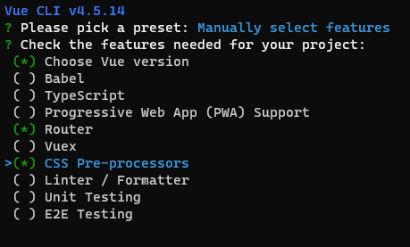
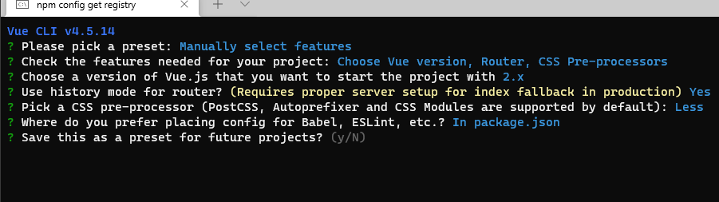
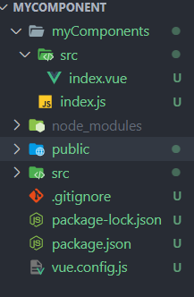

# 编写一个 vue 组件发布至 npm

## 初始化项目

创建项目（这里以文件夹为 mycomponent 为例）：

```sh
vue create mycomponent
```

选择配置





进入项目 `npm i` 安装依赖

## 清理项目文件夹

1. 删除`src/assets`文件夹
2. 删除`src/components`文件夹
3. 删除`src/views/About`文件
4. `src/router/index.js`文件修改如下：

```js
import Vue from "vue"
import VueRouter from "vue-router"
import home from "../views/Home"
Vue.use(VueRouter)

const routes = [
  {
    path: "/",
    name: "Home",
    component: home,
  },
]
const router = new VueRouter({
  mode: "history",
  base: process.env.BASE_URL,
  routes,
})
export default router
```

5. `src/views/Home.vue`修改如下：

```vue
<template>
  <div class="home"></div>
</template>

<script>
export default {
  name: "Home",
}
</script>
```

6. `src/App.vue`修改如下：

```vue
<template>
  <router-view />
</template>
```

7. `public/index.html`修改如下：

```html
<!DOCTYPE html>
<html lang="zh-cn">
  <head>
    <meta charset="utf-8" />
    <meta
      http-equiv="X-UA-Compatible"
      content="IE=edge"
    />
    <meta
      name="viewport"
      content="width=device-width,initial-scale=1.0"
    />
    <link
      rel="icon"
      href="<%= BASE_URL %>favicon.ico"
    />
  </head>
  <body>
    <div id="app"></div>
  </body>
</html>
```

## 开发组件前的准备

1. 现在 src 下的文件只是用来展示我们写的组件（做测试用）

2. 在根目录新建文件夹 myComponents，在此文件夹下进行开发组件

3. 根目录新建`vue.config.js`配置：

```js
const path = require("path")
function resolve(dir) {
  return path.resolve(__dirname, dir)
}

module.exports = {
  /* 模板-src文件夹下用于展示demo内容 */
  pages: {
    index: {
      entry: "src/main.js",
      template: "public/index.html",
      filename: "index.html",
    },
  },

  configureWebpack: {
    /* 配置别名 */
    resolve: {
      extensions: [".js", ".vue", ".json"], // 排除文件类型
      alias: {
        "@": resolve("myComponents"), // 要编写组件的文件夹
        assets: resolve("src/assets"),
        views: resolve("src/views"),
      },
    },
    output: {
      // 暴露默认导出配置
      libraryExport: "default",
    },
  },

  productionSourceMap: false, // 关闭文件映射，避免生产环境F12看到源码

  css: {
    extract: false, // 是否将css提取至独立的css文件中，false 则 js 控制不需要用户导入 css
  },
}
```

pages: 用于展示 demo

configureWebpack：配置文件别名与导出配置

css.extract：配置 css 导入方式

## 编写组件文件

在开始之前先看看使用组件的时候，一般会做两步（element 为例）：

```js
import ElementUI from "element-ui"
Vue.use(ElementUI)
```

1. 为什么要 use()?

use 方法其实就是调用 ElementUI 下 install 方法 (ElementUI.install)

如果插件是一个对象，就需要提供一个 install 方法。

use() 调用 ElementUI.install 时会传入两个参数：第一个则是 Vue，第二个是可选对象

2. 接下来在 myComponents 下创建 index.js 与 src/index.vue



index.js 编写 install 方法并且暴露出去：

```js
import componet from "./src/index.vue"
componet.install = Vue => {
  Vue.component(componet.name, componet)
}
export default componet
```

import 引入自己写好的组件，利用 install 传入的 Vue 组件全局组件。

src/index.vue 则是我们的组件：

```vue
<template>
  <div class="my-component">
    {{ test }}
  </div>
</template>
<script>
export default {
  name: "myComponent",
  data() {
    return {
      test: "我的组件",
    }
  },
}
</script>
<style lang="less" scoped>
.my-component {
  font-size: 25px;
}
</style>
```

## 测试组件

### 全局注册

在项目根目录 src/main.js 中引入：

```js
import test from "@/index" // 这里@ 别名指向的是 myComponents 文件夹
Vue.use(test)
```

在项目根目录 src/views/Home.vue 中使用：

```vue
<template>
  <div class="home">
    <my-component />
  </div>
</template>

<script>
export default {
  name: "Home",
}
</script>
```

:::tip 注意
这里组件名使用的是 my-component 组件内的 name 的名字，要么都驼峰，要么都带中划线。发布组件时最好在文档中说明清楚
:::

### 按需引入

```vue
<template>
  <div class="home">
    <test />
  </div>
</template>

<script>
import test from "@/index" // 这里@ 别名指向的是 myComponents 文件夹
export default {
  name: "Home",
  components: {
    test,
  },
}
</script>
```

## 发布至 npm

### 打包

配置 package.json：

```js
"scripts": {
  "lib": "vue-cli-service build --target lib --name myCom --dest lib myComponents/index.js"
}
```

--target: 构建目标，默认为应用模式。这里修改为 lib 启用库模式;

--name: 打包后的文件名;

--dest：输出目录文件夹名称，默认 dist。这里改成 lib;

[entry]：入口文件，默认为 src/App.vue。这里指定编译 myComponents/index.js。

打包后 lib 文件夹下：

- xx.common.js 给打包器用的 CommonJS 包
- xx.umd.js：直接给浏览器或 AMD loader 使用的 UMD 包
- xx.umd.min.js：压缩后的 UMD 构建版本

## package.json 修改

package.json 文件:

```js
"main": "lib/xxx.umd.min.js", // 设置入口文件
"private": false, // 设置为公开库
"keywords": [], // 设置搜索关键词
"description": "描述",
"author": "作者",
"name": "包的名称", // 在 npm 官网上存在相同的名称则会报错无法上传，会提示你没有权限修改此库
"version": "0.1.0", // 版本，每次上传的版本号不能相同，所以每次上传都要手动升级版本号
```

## 配置 .npmignore

.npmignore 文件中设置忽略上传的文件夹，只有 package.json、README.md 才是需要发布的。README 中写清组件的用法、参数、如何引用、事件等等。

```sh
src/
myComponents/
public/
vue.config.js
babel.config.js
```

## 发布

首先 npmjs.com 上需要有一个账号

如果设置了淘宝镜像需要改回来，`npm config set registry http://registry.npmjs.org`

- `npm login` 登录
- `npm publish` 发布组件到 npm 官网

注意：`package.json`内的`name`值就是这个包的名称，如果 npm 官网有这个包的名称会发布失败。如果这个包是自己的，就会发布新版。如果`version`版本没有比 npm 上的版本低，也会发布失败，需要手动更改版本号再发布。
