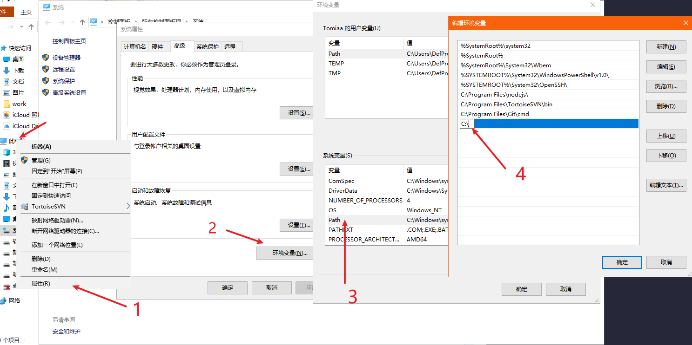
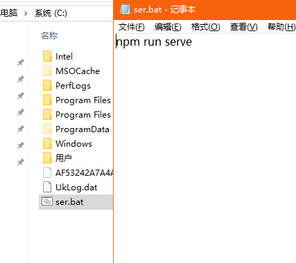
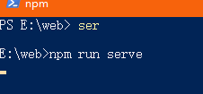

# 配置环境变量快速启动服务 npm run serve

每次输入 npm run serve 都觉得太长了，就算配置 start 之后也要输入 npm start 才行，那么有没有更简单的方法呢？

## 配置环境变量

1. 依次打开 此电脑 -> 属性 -> 高级系统设置 -> 高级 -> 环境变量
2. 找到下面的系统变量，变量名为 path 的一行 -> 编辑

这里以 C 盘为例，新建一个目录，填写文件夹路径

## 添加 bat 文件

1. 新建一个 txt 文件，写入 npm run serve
2. 保存后修改文件后缀名为 bat 格式
3. 修改文件名，文件名就是启动的命令
4. 把文件放在之前添加环境变量的目录，C 盘没有权限先在桌面弄完复制进去

- 最后输入文件名 ser 即可运行刚才 bat 里面的命令（快速设置 build，dev，提交 git 操作也是同理）

