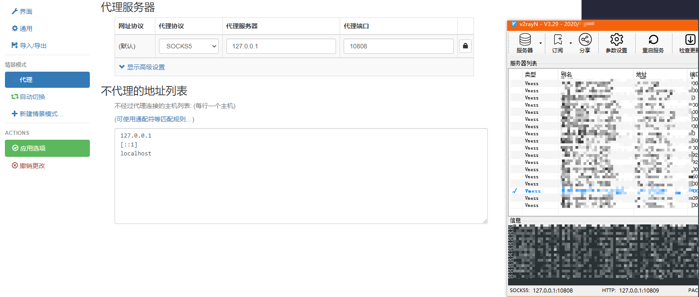
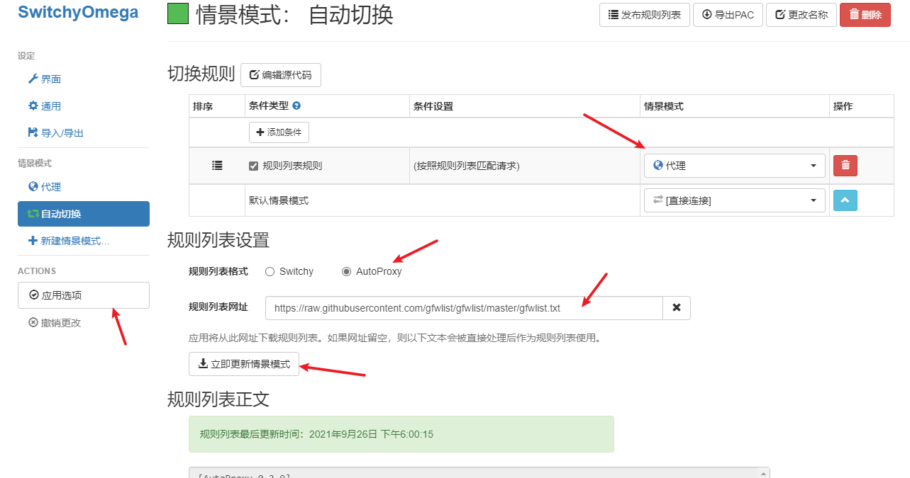
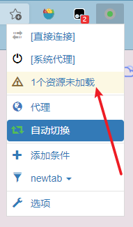
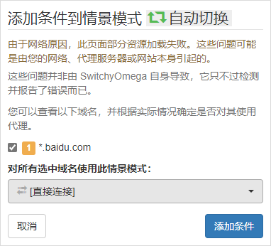
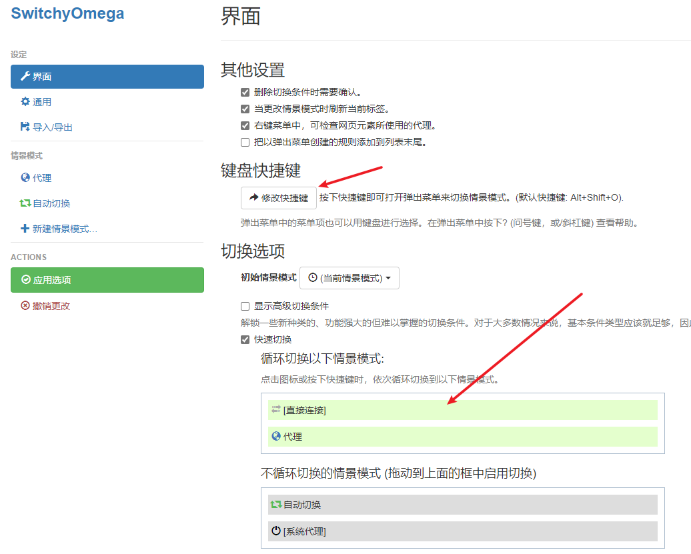

# v2rarN 搭配 SwitchyOmega 自动代理

[SwitchyOmega 安装地址](https://chrome.google.com/webstore/detail/proxy-switchyomega/padekgcemlokbadohgkifijomclgjgif)

## SwitchyOmega 配置代理

协议、地址、端口看 v2rarN 左下角的地址

## 配置自动切换

[规则地址](https://raw.githubusercontent.com/gfwlist/gfwlist/master/gfwlist.txt)

这里匹配到的规则走前面配置的代理模式，没有匹配到的（默认）则直连

但有时候一个网址下面 www.a.com 可能存在 www.b.com 的链接资源，a.com 是代理的话，b.com 缺没有匹配到规则，导致资源加载不出来的情况。

点击 SwitchyOmega 将这些资源地址手动添加规则，让这些网址走代理或直连即可

## 配置快速切换

上面的配置自动切换后，很多情况下一个网站下面又有其它的没有匹配到规则。

每次都手动去添加规则就会很麻烦，有时候一个网站要么全部走代理，要么走直连。

将情景模式拖到循环切换列表上，浏览网页时点击 SwitchyOmega 图标即可快速切换，也可以设置快捷键一键切换。

