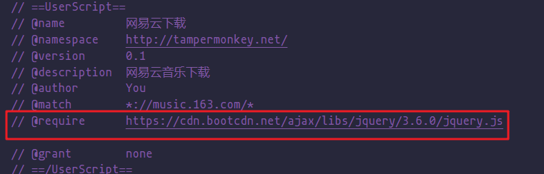

# 用 vscode 如何编写一个 Tampermonkey 油候脚本

当看到 [Greasy Fork](https://greasyfork.org/zh-CN/scripts) 上面这么多大佬写的脚本，为何不自己写一个呢


[tampermonkey 安装地址](https://chrome.google.com/webstore/detail/tampermonkey/dhdgffkkebhmkfjojejmpbldmpobfkfo?hl=zh)

## Tampermonkey 引入外部文件

在开始之前我们先添加一个 Tampermonkey 脚本


function 闭包里面则是我们要写 js 的地方


当然，我们是要在编辑器上写，在这里写的话并没有代码提示，这需要从最上面的注释中引入本地的 js 文件

在引入之前需要允许 Tampermonkey 插件访问本地文件，在插件管理找到允许访问本地 url 即可。这里以 edge 为例，chrome 也是一样设置


接下来在 vscode 中新建一个 js 文件，并把插件编辑的内容复制到 vscode 中。


修改一些注释上的东西

- @name：插件名称
- @namespace：命名空间
- @version：版本号
- @description：详细说明
- @author：作者
- @match：脚本运行在哪些网站上，\* 表示通配符任意字符
- @icon：插件图标

在 Tampermonkey 中添加一行注释，与 vscode 中的文件关联。

```js
// @require file:绝对路径
```


此时文件已经引入进来了，测试之前在 Tampermonkey 上面添加一行 match 来表示在哪个网站上运行这个脚本，这里以百度为例。添加好之后 Ctrl + s 保存一下，再在 vscode 中写一段代码用来后续测试


接下来打开百度


成功！可以看到 Tampermonkey 显示这个插件加载了。想做什么样的操作就跟写原生 js 一样的

<!-- 像做到与[导航页](../../../pages/navigation.md)一样的百度也可以 -->

本站的：


百度 Tampermonkey 脚本写的：


## 引入 jQuery

添加一行注释 @require 引入线上地址即可，vscode 与 Tampermonkey 插件要同时引入，Tampermonkey 插件是用来本地测试的，vscode 写的文件是之后要用来发布的

当然有些链接的 js 是不允许引入的，具体哪些不能引入[点击查看](https://greasyfork.org/zh-CN/help/external-scripts)

```js
// @require      https://cdn.bootcdn.net/ajax/libs/jquery/3.6.0/jquery.js
```



## 发布脚本

在[greasyfork](https://greasyfork.org/zh-CN) 上登录账户发布自己写的脚本


## 配置 git 仓库自动同步脚本

代码提交到 git 仓库之后希望 greasyfork 自动同步自己提交代码，这里以 gitee 为例。

在 gitee 上找到 js 文件点开原始数据的链接复制到 greasyfork 上即可。


默认附加信息也可以选择填写，这里主要是脚本的说明文件。

## 我的脚本

这里我写的一些脚本，欢迎关注，[点击跳转](https://greasyfork.org/zh-CN/users/794260-tomiaa)


