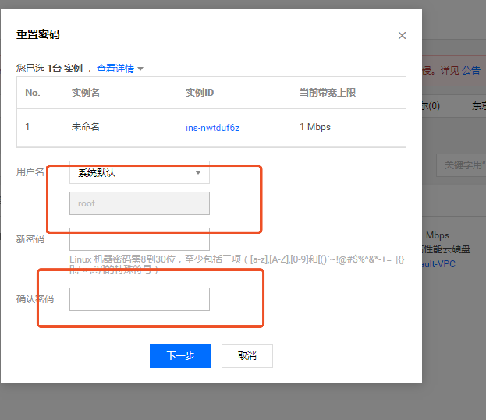
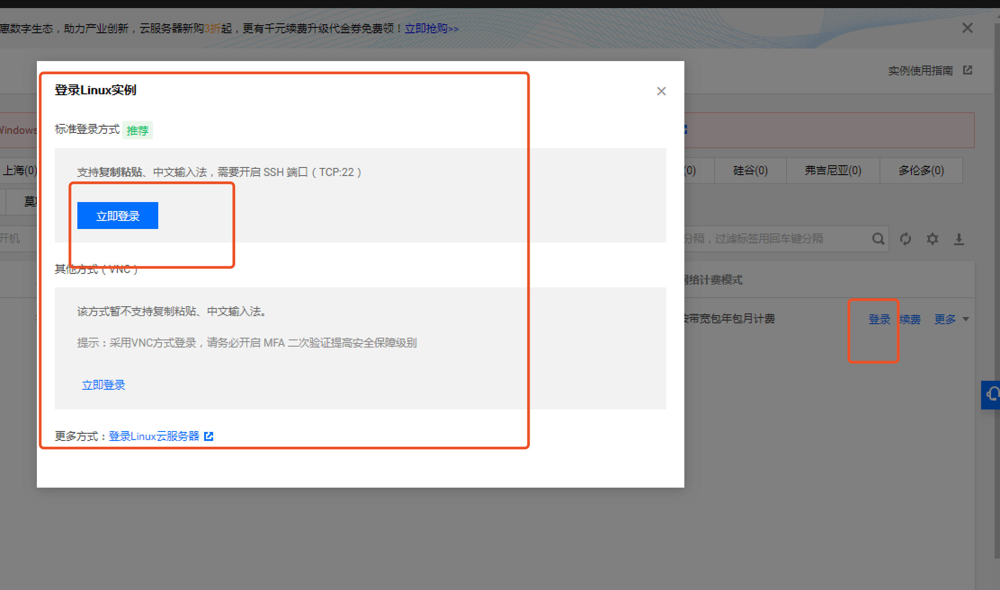
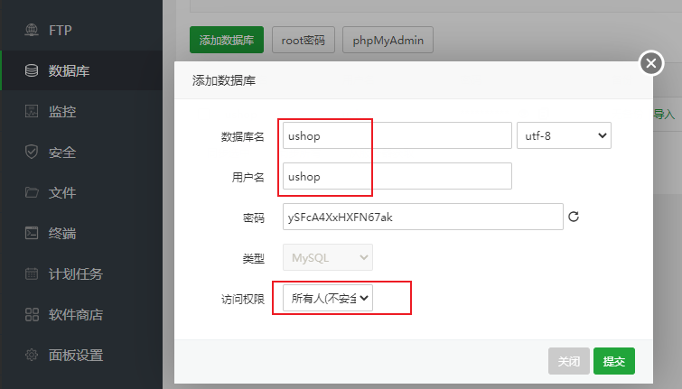
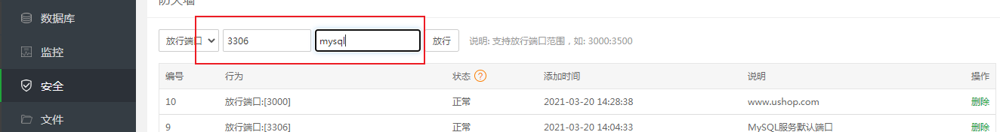
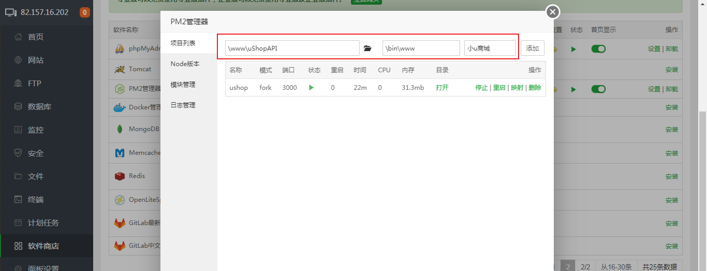

# 服务器部署

腾讯云 免费产品

[打开地址](https://cloud.tencent.com/act/free?fromSource=gwzcw.367585.367585.367585)






## 宝塔面板


## 安装宝塔面板

```
yum install -y wget && wget -O install.sh [http:// download.bt.cn/install/install_6.0.sh && bash install.sh](http:// download.bt.cn/install/install_6.0.sh && bash install.sh)
```

安装完成dos小黑窗有外网地址,账号密码

外网面板地址: http:// xx.xx.xx.xx:8888/ee402e7f

内网面板地址: http:// xx.xx.xx.xx:8888/ee402e7f

username: xxx

password: xxx


## 安装LAMP


## 安装PM2管理器


## 新建数据库



## 上传后端文件

 解压


## 放行端口



## 修改后端文件链接mysql配置


## PM2配置映射



 映射外网地址端口


 查看

